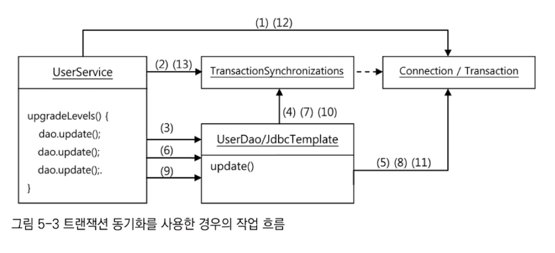

# 5장 서비스 추상화

- 자바에는 사용방법과 형식은 다르지만 기능과 목적이 유사한 기술이 존재함
- 이런 기술을 추상화하고 일관된 방법으로 사용할 수 있도록 지원하는지 확인

## 5.1 사용자 레벨 관리 기능 추가

- UserDAo에 비즈니스 로직 추가
  - 사용자의 레벨은 BASIC, SILVER, GOLD 세가지 중 하나다.
  - 사용자가 처음 가입하면 BASIC 레벨이 되며, 이후 활동에 따라서 한 단계씩 업그레이드 될 수 있다.
  - 가입 후 50회 이상 로그인을 하면 BASIC에서 SILVER 레벨이 된다.
  - SILVER 레벨이면서 30번 이상 추천을 받으면 GOLD 레벨이 된다.
  - 사용자 레벨의 변경 작업은 일정한 주기를 가지고 일괄적으로 진행된다. 변경 작업 전에는 조건을 충족하더라도 레벨의 변경이 일어나지 않는다.

### 5.1.1 필드 추가

#### Level Enum

- 사용자 레벨을 저장할 필드 추가
- User Table에 어떤 타입으로 넣을건지?
- Varchar로 넣는 방법 -> 일정한 종류의 정보를 문자열로 넣는건 별로임
- 레벨을 코드화해서 숫자로 넣는 방법 -> DB 용량 적음, 가벼움
- 프로퍼티 타입도 숫자로? -> 숫자가 의미를 담지못해서 안전하지 못함

``` java
public class User {
	private static final int BASIC = 1;
	private static final int SLIVER = 2;
	private static final int GOLD = 3;
	
	int level;

	public void setLevel(int level) {
		this.level = level;
	}
}
```

- getLEvel()이  돌려주는 숫자값을 사용하면 문제없음
- 하지만 level의 타입이 int이기 때문에 다른 종류의 정보를 넣어도 컴파일러가 다른 정보임을 알지 못함
- 1, 2, 3을 넣으면 문제가 발생할 수 잇음 -> ENUM으로 안전하게 관리하자!

``` java
package com.example.springtoby.toby.enums;

public enum Level {

    BASIC(1), SIlVER(2), GOLD(3);

    private final int value;

    Level(int value) {
        this.value = value;
    }

    public int getValue() {
        return value;
    }

    public static Level valueOf(int value) {
        switch (value) {
            case 1: return BASIC;
            case 2: return SIlVER;
            case 3: return GOLD;
            default: throw new AssertionError("Unknown value: " + value);
        }
    }
}
```

- 타입이 일치하지 않으면 에러를 내면서 문제가 발생할 것

#### User 필드

- Level 타입을 User에 추가

``` java
package com.example.springtoby.toby;

import com.example.springtoby.toby.enums.Level;

public class User {

    String id;
    String name;
    String password;
  
    Level level;
    int login;
    int recommend;

    public Level getLevel() {
        return level;
    }

    public void setLevel(Level level) {
        this.level = level;
    }
  ...
```


- 기타 테스트코드 추가...

#### UserDaoJdbc 수정

``` java
public class UserDaoJdbc implements UserDao {
  ...
    private RowMapper<User> userMapper = new RowMapper<User>() {
        public User mapRow(ResultSet rs, int rowNum) throws SQLException {
         User user = new User();
         user.setId(rs.getString("id"));
         user.setName(rs.getString("name"));
         user.setPassword(rs.getString("password"));
         user.setLevel(Level.valueOf(rs.getInt("level")));
         user.setLogin(rs.getInt("login"));
         user.setRecommend(rs.getInt("recommend"));
         return user;
    }
  }
   public void add(final User user) throws DuplicateUserIdException {
      this.jdbcTemplate
              .update("insert into users(id, name, password) values(?,?,?,?,?,?)"
                      , user.getId(), user.getName(), user.getPassword(), user.getLevel().getValue(), user.getLogin(), user.getRecommend());
  }
}
```

### 5.1.2 사용자 수정 기능 추가

- 사용자 정보는 여러번 수정될 수 있음
- pk를 제외하고 수정할 수 있음

#### 테스트코드

``` java
@Test
public void update() throws SQLException {
    dao.deleteAll();

    dao.add(user1);

    user1.setName("오민규");
    user1.setPassword("springno6");
    user1.setLevel(Level.GOLD);
    user1.setLogin(1000);
    user1.setRecommend(999);
    dao.update(user1);

    User user1Update = dao.get(user1.getId());
    checkSameUser(user1, user1Update);
}
```

#### UserDao와 UserDaoJdbc 수정

``` java
class UserDao {
  ...
	public void update(User user) {
        jdbcTemplate.update(
                "update users " +
                        "set name = ?, password = ?, level =?, login = ?, " +
                        "recommend = ? where id = ?",
                user.getName(), user.getPassword(),
                user.getLevel().getValue(), user.getLogin(),
                user.getRecommend(),
                user.getId()
        );
    }

}
```


### 5.1.3 UserService.upgradeLevels()

- 레벨을 관리하는 기능
- 데이터를 가져와서 레벨 업그레이드하면서, update()로 DB에 결과를 넣으면 됨
- UserService에서 비즈니스 로직 작성
- user를 가져와서 변경 조건에 해당하면 flag를 true로 변경하고 업데이트

``` java
package com.example.springtoby.toby;

import com.example.springtoby.toby.enums.Level;
import lombok.RequiredArgsConstructor;
import org.springframework.stereotype.Service;

import java.util.List;

@RequiredArgsConstructor
@Service
public class UserService {

    private final UserDao userDao;

    public void upgradeLevels() {
        List<User> userList = userDao.getAll();
        
        for(User user : userList) {
            Boolean changed = null;

            if (user.getLevel() == Level.BASIC && user.getRecommend() >= 50) {
                user.setLevel(Level.SIlVER);
                changed = true;
            } else if (user.getLevel() == Level.SIlVER && user.getRecommend() >= 30) {
                user.setLevel(Level.GOLD);
                changed = true;
            } else if (user.getLevel() == Level.GOLD) {
                changed = true;
            } else {
                changed = false;
            }

            if (changed) {
                userDao.update(user);
            }
            
        }
        
    }
}
```


### 5.1.4 UserService.add()

- 비즈니스 로직에서 해당 부분을 가진다면 더욱 충실한 역할을 할 것임

- 처음 가입하는 사용자는 기본적으로 BASIC 레벨을 가짐

``` java
public UserService {
	/// ...

		public void add(User user) {
        if(user.getLevel() == null) user.setLevel(Level.BASIC);
        userDao.add(user);
    }
}
```

- 테스트코드 작성 패스


### 5.1.5 코드 개선

#### 검토사항

- 코드에 중복된 부분은 없는가?
- 코드가 무엇을 하는 것인지 이해하기 불편하지 않은가?
- 코드가 자신이 있어야 할 자리에 있는가?
- 앞으로 변경이 일어난다면 어떤 것이 있을 수 있고, 그 변환에 쉽게 대응할 수 있게 작성되어 있는가?

#### upgradeLevels() 메소드의 문제점

- if else 문이 많아서 코드를 읽기 불편함

``` java
package com.example.springtoby.toby;

import com.example.springtoby.toby.enums.Level;
import lombok.RequiredArgsConstructor;
import org.springframework.stereotype.Service;

import java.util.List;

@RequiredArgsConstructor
@Service
public class UserService {

    private final UserDao userDao;

    public void upgradeLevels() {
        List<User> userList = userDao.getAll();

        for(User user : userList) {
            
            if (canUpgradeLevel(user)) {
                upgradeLevel(user);
            }
        }
    }
    
    private boolean canUpgradeLevel(User user) {
        Level currentLevel = user.getLevel();
        switch (currentLevel) {
            case BASIC: return (user.getLogin() >= 50);
            case SILVER: return (user.getRecommend() >= 30);
            case GOLD: return false;
            default: throw new IllegalArgumentException("Unknown Level " + currentLevel);
        }
    }
    
    private void upgradeLevel(User user) {
        if (user.getLevel() ==Level.BASIC) user.setLevel(Level.SIlVER);
        else if (user.getLevel() == Level.SIlVER) user.setLevel(Level.GOLD);
        userDao.update(user);
    }

}
```

- 코드를 읽기 훨씬 편해짐

추가로 upgradeLevel의 코드는 아직 덜 깔끔함

- 다음단계를 가져오는 역할을 Enum에게 맡김

``` java
package com.example.springtoby.toby.enums;

public enum Level {

    GOLD(3, null),
    SIlVER(2, GOLD),
    BASIC(1, SIlVER);

    private final int value;
    private final Level next;

    Level(int value, Level next) {
        this.value = value;
        this.next = next;
    }

    public int getValue() {
        return value;
    }

    public Level getNext() {
        return next;
    }

    public static Level valueOf(int value) {
        switch (value) {
            case 1: return BASIC;
            case 2: return SIlVER;
            case 3: return GOLD;
            default: throw new AssertionError("Unknown value: " + value);
        }
    }

}
```

``` java
class User {
	public void upgradeLevel() {
        Level nextLevel = this.level.getNext();
        if (nextLevel == null) {
            throw new IllegalArgumentException(this.level + "은 업그레이드가 불가능합니다.");
        } else {
            this.level = nextLevel;
        }
    }
}
```

``` java
class UserService{
	private void upgradeLevel(User user) {
        user.upgradeLevel();
        userDao.update(user);
  }
}
```


## 5.2 트랜잭션 서비스 추상화

>  **"정기 사용자 레벨 관리 작업을 수행중 네트워크가 끊켜서 서버에 장애로 인하여 작업을 완료할 수 없다면 그동안 변경된 작업을 그대로 둬야하나요 초기로 둬야하나요? "**

### 5.2.1 모 아니면 도

- 예외적인 상황을 강제로 발생시키는 테스트를 만듬
- 강제로 예외를 발생시키는 방법
  - 예외를 강제로 발생시키도록 코드 수정 -> 코드를 건들이는건 좋은 상황이 X
- 테스트용으로 특별히 만든 UserService의 대역을 사용
  - UserService를 대신해서 테스트의 목적에 맞게 동작하는 클래스를 만들어 사용
  - UserService를 상속하고, 일부 추가, 일부 오버라이딩해서 사용

``` java
new User("bumjin", "박범진", "p1", Level.BASIC, MIN_LOG_COUNT_FOR_SILVER -1, 0),
new User("joytouch", "강명성", "p2", Level.BASIC, MIN_LOG_COUNT_FOR_SILVER, 0),
new User("erwins", "신승한", "p3", Level.SIlVER, 60, MIN_RECOMMEND_FOR_GOLD -1),
new User("madnite1", "이상호", "p4", Level.SIlVER, 60, MIN_RECOMMEND_FOR_GOLD),
new User("green", "오민규", "p5", Level.GOLD, 100, 100)
```

- 5명의 사용자 중 2, 4번째가 업그레이드 대상임
- 4번째 사용자를 처리하는 중 예외 발생시키기

``` java
static class TestUserService extends UserService {
    private String id;

    private TestUserService(String id) { // 예외를 발생시킬 User 오브젝트의 id를 지정할 수 있게 함
        this.id = id;
    }

    protected void upgradeLevel(User user) { // 오버라이드
        if (user.getId().equals(this.id)) throw new TestUserServiceException();
      // 강제로 예외를 발생시킴
        super.upgradeLevel(user);
    }
}
```

- 이렇게 하면 모든게 돌아가는 것을 기대하지만 그렇지 않음
- 현재 동작하는 업데이트 기능이 하나의 트랜잭션으로 동작하지 않기 때문


### 5.2.2 트랜잭션 경계설정

- 트랜잭션 롤백: 작업중 에러가 발생했을 때 처음으로 돌아가는 것
- 트랜잭션 커밋: SQL 수행 작업이 다 마무리되었을 때 작업을 확정시키는 것

``` java
Connection c = dataSource.getConnection();

c.setAutoCommit(false); // 자동 커밋을 false로 설정
try{
	PrepardeStatement st1 = c.prepareStatement("update users ...");
	st1.executeUpdate();
	
	PrepardeStatement st2 =	c.prepateStatement("delete users...");
	st2.executeUpdate();
   
	c.commit(); //트랜잭션 커밋 
    
}catch(Exception e){
	c.rollback() //트랜잭션 롤백
}
c.close();
```

- 이렇게 c.setAutoCommit(false) 로 트랜잭션의 시작을 선언하고 commit () 또는 rollback()로 트랜잭션을 종료하는 작업을 트랜잭션의 경계설정이라고 함
- 하나의 DB 커넥션에서 만들어지는 트랜잭션을 로컬 트랜잭션이라고도 함

#### 왜 기존 코드에는 트랜잭션이 적용되지 않았을까?

- 트랜잭션을 시작하고, 커밋, 롤백하는 코드가 없기 때문
- 템플릿 메소드 호출 한 번에 한개의 DB 커넥션이 만들어지고 닫히기 때문
- JdbcTemplate의 메소드를 사용하는 UserDao는 각 메소드마다 하나의 독립적인 트랜잭션으로 실행됨


### 5.2.3 트랜잭션 동기화

- 스프링이 제안하는 방식

- Connection 오브젝트를 저장소에 보관하고, DAO에서 저장된 Connection을 가져다가 사용하는 방식



1. UserService 는 Connection을 생성하고
2. 이를 트랜잭션 동기화 저장소에 저장 해두고 Conneciton의 setAutoCommit(false)를 호출해 트랜잭션을 시작 시킨후에 본격적으로 DAO의 기능을 이용하기 시작한다.
3. 첫번째 update() 메소드가 호출되고 update()메소드 내부에서 이용하는 JdbcTemplate 메소드에서는 가장먼저
4. 트랜잭션 동기화 저장소에 현재 시작된 트랜잭션을 가진 Connection 오브젝트가 존재하는지 확인한다 . (2) upgradeLevels() 메소드 시작 부분에서 저장해둔 Connection을 발견하고 이를 가져온다 .
5. Connection을 이용해 PreparedStatement를 만들어 수정 SQL을 실행한다. 트랜잭션 동기화 저장소에서 DB 커넥션을 가져왔을때는 JdbcTemplate은 Connection을 닫지 않은채로 작업을 마친다 .


- Connection은 열리고, 트랜잭션은 진행중인 채로 동기화 저장소에 저장되어있음
- 정상적으로 종료되었다면 Connection의 commit()을 호출해서 완료함
- Connection 오브젝트를 제거

``` java
private DataSource dataSource;

public void setDateSource(DataSource dataSource){ // Connection을 생성할 때 사용할 DataSource
	this.dataSource = dataSource;
}

public void upgradeLevels() throws Exception{
    TransactionSynchronizationManager.initSynchronization();
    // 트랜잭션 동기화 관리자를 이용해 동기화 작업 초기화
    Connection c = DataSourceUtils.getConnection(dataSource);
    // 커넥션을 생성하고 트랜잭션을 시작, 이후의 DAO 작업은 모두 여기서 시작한 트랜잭션 안에서 진행
    c.setAutoCommit(false);
    
    try{
        List<User> users = userDao.getAll();
        for(User user:users){
            if(canUpgradeLevel(user)){
                upgradeLevel(user);
            }
        }
        c.commit(); // 완료되면 커밋
    }catch(Exception e){ //예외 발생시 롤백
        c.rollback();
        throw e;
    }finally{
        DataSourceUtils.releaseConnection(c,dataSource);
        TransactionSynchronizationManager.unbindResource(this.dataSource);
        TransactionSynchronizationManager.clearSynchronization();
    }
}
```

#### JdbcTemplate와 트랜잭션 동기화

- JdbcTemplate는 JDBC 작업의 템플릿 메소드를 호출하면 직접 Connection을 생성하고 종료하는 일을 모두 담당함
- 트랜잭션 동기화 저장소에 등록된 DB 커넥션이나 트랜잭션이 없으면 JdbcTemplate는 직접 DB 커넥션은 만들고 트랜잭션을 시작함


### 5.2.4 트랜잭션 서비스 추상화

- 한개 이상의 DB 작업을 하나의 트랜잭션으로 만드는 것을은 JDBC의 Connection을 이용한 방식(로컬 트랜잭션)으로는 불가능 -> 1개의 연결에 종속되기 때문
- 이를 해결하기 위해서 별도의 트랜잭션 관리자로 관리하는 글로벌 트랜잭션 방식을 사용해야함
- 트랜잭션 매니저를 지원하기 위한 API인 JTA를 제공 (Java Transaction API)


``` java
InitialContext ctx = new InitialContext();
UserTransaction tx = (UserTransaction)ctx.lookup(USER_TX_JNDI_NAME);
//JNDI를 이용해서 서버의 UserTransaction 오브젝트를 가져온다.
tx.begin();
Connection c = dataSource.getConnection(); //JNDI로 가져온 DataSource를 사용해야한다.

try{ //데이터 엑세스 코드
	tx.commit();
}catch(Exception e){
	tx.rollback();
}finally{
	c.close();
}
```

- 로컬 트랜잭션을 글로벌로 바꾸려면 UserService 코드를 수정해야함
- JDBC DAO에 의존하게 되어버림


- 트랜잭션의 경계설정을 담당하는 코드는 일정한 패턴을 가지는 유사한 구조
  - 추상화를 생각할 수 있음
- 스프링이 제공하는 트랜잭션 추상화 계층구조


``` java
pulic void upgradeLevels(){
	PlatformTransactionManager transactionManager =
		new DataSourceTransactionManager(dataSource);
		
	TransactionStatus status =
		transactionManager.getTransaction(new DefaultTransactonDefinition());
	try{ // 트랜잭션 내부 작업
		List<User> users = userDao.getAll();
		for(User user:users){
			if(canUparadeLevel(user)){
				upgradeLevel(user);
			}
		}
		transactionManger.commit(status); // 커밋
	}catch(RuntimeException e){
		transactionManager.rollback(status); // 롤백
		throw e;
	}
}
```

- PlatformTransactionManager - 스프링이 제공하는 트랜잭션 경계설정을 위한 추상 인터페이스

- DataSourceTransactionManager - JDBC의 로컬 트랜잭션을 이용할 때 사용

#### 트랜잭션 기술 설정의 분리

- 글로벌 트랜잭션으로 변경하려면?
- DataSourceTransactionManager를 JTATransactionManager로 바꿔주면 됨

``` java
pulic class UserService {
	...
	private PlatformTransactionManager transactionManager;
	
	public void setTransactionManager(PlatformTransactionManager transactionManager){
		this.transactionManager = transationManger;
	}
	
	public void upgradeLevel(){
		TransactionStatus status = 
			this.transactionManager.getTransaction(new DefaultTransactionDefinition());
			try{
				List<User> users = userDao.getAll();
				for(User user:uesrs){
					if(canUparadeLevel(user)){
						upgradeLevel(user);
					}
				}
                this.transactionManager.commit(status);
			}catch(RuntimeException e){
                this.transactionManager.rollback(status);
                throw e;
            }
	}
    ...
}
```

- PlatformTransactionManager를 빈으로 독립시키고 DI로 사용하도록 수정


## 5.3 서비스 추상화와 단일 책임 원칙

#### 수직, 수평 계층구조와 의존관계

- 기술과 서비스에 대한 추상화 기법을 이용하면 특정 기술환경에 종속되지 않는 포터블한 코드를 만들 수 있음
- 수평적인 분리
- 트랜잭션의 추상화는 좀 다름
- 비즈니스 로직과 로우레벨의 트랜잭션 기술이 아예 다른 계층의 특성을 가지는 코드를 분리한 것
- 
- 애플리케이션 로직의 종류에 따른 수평적인 구분이든, 로직과 기술이라는 수직적인 구분이든 모두 결합도가 낮으며, 서로 영향을 주지 않고 자유롭게 확장될 수 잇는 구조를 만들 수 잇는 데는 스프링의 DI가 중요한 역할을 함

#### 단일 책임 원칙

- 적절한 분리가 가져오는 특징임
- 하나의 모듈은 한 가지 책임을 가져야 한다는 의미
- 사용자 레벨을 관리 + 트랜잭션을 관리 처럼 두 가지 책임을 가지게 되면 코드를 바꾸게 되는 이유가 두 가지가 되는 것

##### 장점

- 어떤 변경이 필요할 때 수정 대상이 명확해짐
- 기술 계층과의 연동을 담당하는 기술 추상화 계층의 설정만 바꿔주면 됨


## 5.4 메일 서비스 추상화

### 5.4.1 JavaMail을 이용한 메일 발송 기능

패스

### 5.4.2 JavaMail이 포함된 코드의 테스트

패스

### 5.4.3 테스트를 위한 서비스 추상화

- 구성상에서 문제가 발생하는 것들은 테스트에서 사용할 별도의 간단한 오브젝트를 만들어서 사용하면 됨
- 추상화를 통해 바꿔치기하기 쉽도록 구성

### 5.4.4 테스트 대역

패스

## 5.5 정리

- 비즈니스 로직을 담은 코드는 데이터 액세스 로직을 담은 코드와 깔끔하게 분리되는 것이 바람직하다. 비즈니스 로직 코드 또한 내부적으로 책임과 역할에 따라서 깔끔하게 메소드로 정리돼야 한다.
- 이를 위해서는 DAO의 기술 변화에 서비스 계층의 코드가 영향을 받지 않도록 인터페이스와 DI를 잘 활용해서 결합도를 낮춰줘야 한다.
- DAO를 사용하는 비즈니스 로직에는 단위 작업을 보장해주는 트랜잭션이 필요하다.
- 트랜잭션의 시작과 종료를 지정하는 일을 트랜잭션 경계설정이라고 한다. 트랜잭션 경계설정은 주로 비즈니스 로직 안에서 일어나는 경우가 많다.
- 시작된 트랜잭션 정보를 담은 오브젝트를 파라미터로 DAO에 전달하는 방법을 매우 비효율적이기 때문에 스프링이 제공하는 트랜잭션 동기화 기법을 활용하는 것이 편리하다.

- 자바에서 사용되는 트랜잭션 API의 종류와 방법은 다양하다. 환경과 서버에 따라서 트랜잭션 방법이 변경되면 경계설정 코드도 함께 변경돼야 한다.

- 트랜잭션 방법에 따라 비즈니스 로직을 담은 코드가 함께 변경되면 단일 책임 원칙에 위배되며, DAO가 사용하는 특정 기술에 대해 강한 결합을 만들어낸다.

- 트랜잭션 경계설정 코드가 비즈니스 로직 코드에 영향을 주지 않게 하려면 스프링이 제공하는 트랜잭션 서비스 추상화를 이용하면 된다.

- 서비스 추상화는 로우레벨의 트랜잭션 기술과 API의 변화에 상관없이 일관된 API를 가진 추상화 계층을 도입한다.

- 서비스 추상화는 테스트하기 어려운 JavaMail 같은 기술에도 적용할 수 있다. 테스트를 편리하게 작성하도록 도와주는 것만으로도 서비스 추상화는 가치가 있다.

- 테스트 대상이 사용하는 의존 오브젝트를 대체할 수 있도록 만든 오브젝트를 테스트 대역이라고 한다.

- 테스트 대역은 테스트 대상 오브젝트가 원활하게 동작할 수 있도록 도우면서 테스트를 위해 간접적인 정보를 제공해주기도 한다.

- 테스트 대역 중에서 테스트 대상으로부터 전달받은 정보를 검증할 수 있도록 설계된 것을 목 오브젝트라고 한다.
