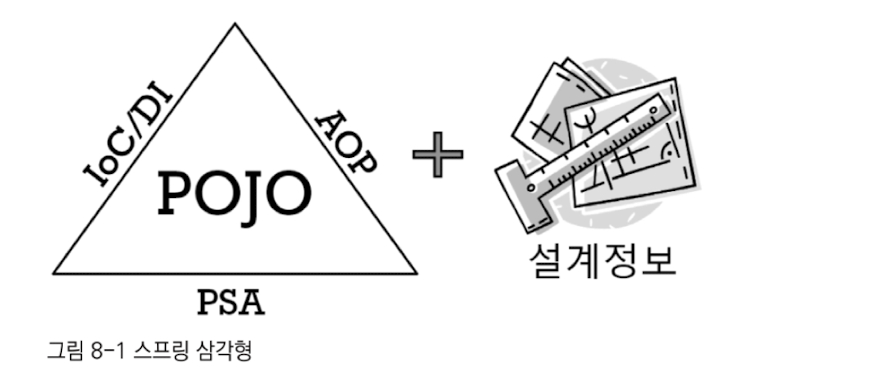
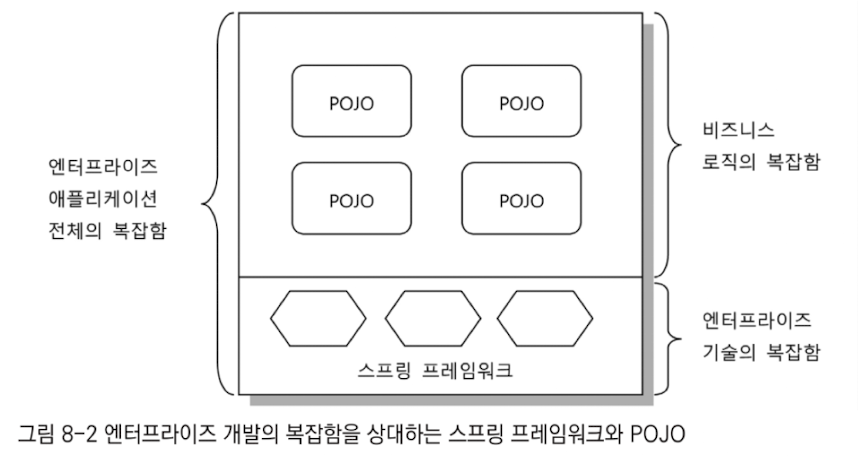

# 8장 스프링이란 무엇인가?

## 8.1 스프링의 정의

- 자바 엔터프라이즈 개발을 편하게 해주는 오픈소스 경량급 애플리케이션 프레임워크

#### 애플리케이션 프레임워크

- 특정 계층이나, 기술, 업무 분야에 국한되지 않고 애플리케이션의 전 영역을 포괄하는 범용적인 프레임워크
- 애플리케이션 개발의 전 과정을 빠르고 편리하며 효율적으로 진행하는 데 일차적인 목표를 두는 프레임워크
- 애플리케이션의 전 영역을 관통하는 일관된 프로그래밍 모델과 핵심 기술을 바탕으로 해서 각 분야의 특성에 맞는 필요를 채워주고 있음

#### 경량급

- 불필요하게 무겁지 않음
- 가장 단순한 서버환경인 톰캣이나 제티에서도 완벽하게 동작함
- 서블릿 컨테이너만으로 충분하니 다른 EJB와 같은 고급 WAS를 사용하지 않아도 됨
- 지원하는 기술 수준은 비슷하더라도 그것을 훨씬 빠르게 간편하게 작성하게 해줌

#### 자바 엔터프라이즈 개발을 편하게

- 애플리케이션 개발이랑 개발자가 복잡하고 실수하기 쉬운 로우레벨 기술에 많은 신경을 쓰지 않으면서도 애플리케이션의 핵심인 사용자의 요구사항, 즉 비즈니스 로직을 빠르고 효과적으로 구현하는 것

#### 오픈소스

- 아파치 라이선스 2.0을 사용함 (비교적 제약이 적고 사용이 매우 자유로운 편)
- 매우 빠르고 유연한 개발이 가능함
- 사용자의 피드백이 빨리 전달되고 반영됨
- 라이선스 비용에 대한 부담이 없음
- 하지만 지속적이고 안정적인 개발이 계속될지가 불확실함
  - 프레임워크 사용자에게 지속적인 신뢰를 줄 수 있도록 기업을 만듬

## 8.2 스프링의 목적

### 8.2.1 엔터프라이즈 개발의 복잡함

#### 기술적인 제약조건과 요구사항이 늘어감

- 엔터프라이즈 시스템이 기업 업무를 처리하는 데 핵심적인 역할로 등장하고 중요해지면서 점점 더 기술적인 요구는 심화되고 그에 따른 복잡도가 증가함
- 이전에는 그다지 신경 쓰지 않았던 보안에 관한 부분도 갈수록 중요해지고, 그에 따라 시스템 설계자와 개발자 개개인이 져야 할 기술적인 부담은 점점 더 커져감

#### 엔터프라이즈 애플리케이션이 구현해야 할 핵심기능인 비즈니스 로직의 복잡함이 증가함

- 대부분의 업무 처리는 컴퓨터를 이용하지 않고는 아예 진행하기 힘들 만큼 엔터프라이즈 시스템에 대한 업무 의존도가 높아짐

#### 복잡함을 가중시키는 원인

비즈니스 로직과 엔터프라이즈 기술이라는 두 가지 복잡함이 한데 얽혀 있기 때문

### 8.2.2 복잡함을 해결하려는 도전

#### 제거될 수 없는 근본적인 복잡함

- 복잡함을 효과적으로 상대할 수 있는 전략과 기법이 필요함
- 성격이 다른 이 두 가지 복잡함을 분리하는게 중요함

#### 실패한 해결책: EJB

- EJB도 비즈니스 로직을 효과적으로 개발하는 데 집중할 수 있게 하자는 목표가 있었음
- 기술적인 복잡함을 덜어주려는 시도를 하다가 오히려 더 큰 복잡함을 추가하는 실수를 함
- 발전 주기도 너무 느렸음

#### 비침투적인 방식을 통한 효과적인 해결책: 스프링

- 침투적인 기술 - 기술을 적용했을 때 그 기술과 관련된 코드나 규약 등이 코드에 등장하는 경우
- 비침투적인 기술 - 기술의 적용 사실이 코드에 직접 반영되지 않는다는 특징을 가짐
  - 애플리케이션 코드 여기저기에 불쑥 등장하거나 코드의 설계와 구현 방식을 제한하지는 않음
- 스프링은 비침투적인 기술을 적용하여 기술적인 복잡함과 비즈니스 로직을 깔끔하게 분리함
- 근본적인 복잡함의 원인이 사라진 것은 하니지만, 각각을 효율적으로 처리할 수 있게 됨

### 8.2.3 복잡함을 상대하는 스프링의 전략

#### 기술에 대한 접근 방식이 일관성이 없고, 특정 혼경에 종속적이다

- 서비스 추상화
  - 트랜잭션 추상화, OXM 추상화, 데이터 액세스에 관한 일관된 예외변환 기능, 트랜잭션 동기화 기법 등
  - 추상화를 통해 로우레벨의 기술 구현 부분과 기술을 사용하는 인터페이스를 분리하고, 환경과 세부 기술에 독립적인 접근 인터페이스를 제공하는 것이 가장 좋은 해결책임
  - 데이터 액세스 예외에 대한 추상화 - 서비스 레이어의 코드가 특정 기술이 발생시키는 예외에 종속되지 않음
    - throws를 선언해야 하는 것을 방지함
  - 스프링이 제공하는 템플릿 / 콜백 패턴은 판에 박힌 반복적인 작업 흐름과 API 사용 코드를 제거

#### 기술적인 처리를 담당하는 코드가 성격이 다른 코드에 섞여서 등장한다

- AOP
  - 최후까지 애플리케이션 로직을 담당하는 코드에 남아 있는 기술 관련 코드를 깔끔하게 분리해서 별도의 모듈로 관리하게 해주는 기술
  - 기술을 다루는 코드로 인한 복잡함이 기술 그 자체 이상으로 불필요하게 증대되지 않도록 도와주는 가장 강력한 수단

#### 비즈니스와 애플리케이션 로직의 복잡함을 상대하는 전략

- 위 방식으로 불필요한 코드를 제거하면 순수하게 애플리케이션의 주요 기능과 비즈니스 로직을 담은 코드만 독립적으로 존재하게 됨
- 기술적인 오류는 시스템을 복구하거나 빠르게 대응하면 큰 문제가 발생하지 않음
- 비즈니스 로직을 다루는 핵심 코드에 오류가 있으면 치명적임
- 스프링은 비즈니스 로직을 담당하는 객체들에게 적절한 엔터프라이즈 기술 서비스가 제공되도록 은밀히 도움
- 비즈니스 로직의 복잡함을 상대하는 전략은 자바라는 객체지향 기술 그 자체임
- 스프링은 단지 객체지향 언어의 장점을 제대로 살리지 못하게 방해했던 요소를 제거하도록 도와줄 뿐임

#### 핵심도구: 객체지향과 DI

- 결국 스프링의 모토는 기본으로 돌아가자 임
- 기술적인 복잡함을 효과적으로 다루게 해주는 것은 모두 DI를 바탕으로 하고있음
- 스프링은 단지 객체지향 프로그래밍 기법을 더욱 편하고 쉽게 사용하도록 도와줄 뿐임

## 8.3 POJO 프로그래밍

- 스프링의 정수는 엔터프라이즈 서비스 기능을 POJO에 제공하는 것이라고 함

### 8.3.1 스프링의 핵심: POJO

- 스프링의 주요 기술인 IoC/DI, AOP와 PSA는 애플리케이션을 POJO로 개발할 수 있게 해주는 가능기술이라고 불림

### 8.3.2 POJO란 무엇인가?

- Plain Old Java Object의 약자
- 자바 오브젝트에는 그럴싸한 이름이 없었기 때문에 만들어짐

### 8.3.3 POJO의 조건

#### 특정 규약에 종속되지 않음

- 자바 언어와 꼭 필요한 API 외에는 종속되지 않아야 함
- 특정 규약을 따라 비즈니스 컴포넌트를 만들어야 하는 경우는 POJO가 아님

#### 특정 환경에 종속되지 않음

- 특정 환경이 의존 대상 검색 방식에 종속적이라면 POJO라고 할 수 없음
- 환경에 독립되어야 함
- 나중에 웹 컨트롤러와 연결되어 사용될 것이 뻔해도 직접적으로 웹이라는 환경으로 제한해버리는 오브젝트나 API에 의존해서는 안됨

### 8.3.4 POJO의 장점

- 특정한 기술과 환경에 종속되지 않기 때문에 깔끔해짐
- 자동화된 테스트에 유리함
- 객체지향적 설계를 자유롭게 적용할 수 있음

### 8.3.5 POJO 프레임워크

- POJO 프로그래밍이 가능하도록 기술적인 기반을 제공하는 프레임워크를 POJO 프레임워크라고 함
- 스프링은 비즈니스 로직의 복잡함와 엔터프라이즈 기술의 복잡함을 분리해서 구성할 수 있게 도와줌
  - 하지만 자신은 기술 영역에만 관여하지 비즈니스 로직을 담당하는 POJO에서는 모습을 감춤
- 스프링을 사용한다고 해서 기술적인 부담이 줄어드는건 아님. 대신 스프링은 개발자들이 복잡한 엔터프라이즈 기술보다는 이러한 객체지향적인 설계와 개발의 원리에 좀 더 집중할 수 있도록 기회를 줌
- 스프링 프레임워크와 하이버네이트를 대표적인 POJO 프레임워크로 꼽을 수 있음

## 8.4 스프링의 기술

### 8.4.1 제어의 역전 (IoC) / 의존관계 주입 (DI)

- 스프링의 가장 기본이 되는 기술이자 스프링의 핵심 개발 원칙
- AOP와 PSA의 바탕이기도 함
- new로 객체를 생성해서 사용하는 강한 결합보다 나은 이유는?
  - 유연한 확장이 가능하게 하기 위해서
    - 확장에는 열려있고 변경에는 닫혀있음
- A->B의 의존관계에서 B가 변경되어도 A는 영향을 받지 않고 유지 가능함
  - B는 유연한 확장, A는 변경 없이 재사용 가능

#### 핵심기능의 변경

- DI의 가장 대표적인 적용 방법은 바로 의존 대상의 구현을 바꾸는 것임
- 디자인 패턴의 전략 패턴을 활용
- A→B 구조에서 A의 기능 일부를 B에게 위임한다고 했을 때 B의 구현 방식을 필요에 따라 통째로 B1, B2, B3로 바꿈
- DAO 구현을 JDBC, JPA, Hibernate, 등으로 바꾸는 것을 생각할 수 있음

#### 핵심기능의 동적인 변경

- 의존 오브젝트의 핵심기능 자체를 바꾸는 것
- 동적으로 매번 다르게 애플리케이션이 동작하는 중간에 의존 대상을 변경하는 것
- Datasource를 사용자마다 잘 선택해서 사용하는 것처럼 활용

#### 부가기능의 추가

- 데코레이터 패턴 사용
- 트랜잭션 기능을 부여하는 것이 예시
- 부가 기능의 추가 방식을 특정 오브젝트가 아니라 좀 더 많은 대상으로 일반화해서 적용하면 AOP가 됨

#### 인터페이스의 변경

- 사용하려는 오브젝트가 클라이언트와 호환되지 않는 경우
- 여러 종류의 인터페이스를 가졌지만 사실은 비슷한 기능을 담당하는 오브젝트를 바꿔가면서 사용하고 싶은 경우
- 어댑터 패턴 응용

#### 프록시

- 필요한 시점에 실제 사용할 오브젝트를 초기화하고 리소스를 준비하게 해주는 지연 로딩에서 사용

#### 템플릿과 콜백

- 반복적으로 등장하지만 항상 고정적인 작업 흐름과 그 사이에서 자주 바뀌는 부분을 분리해서 템플릿과 콜백으로 만들고 DI를 적용 -> 코드를 간결하게 사용 가능

- 템플릿은 한 번 만들어두면 콜백이 바뀌어도 재사용할 수 있다는 기능의 확장에도 변하지 않는다는 OCP의 폐쇄 원칙에도 잘 들어맞음

#### 싱글톤과 오브젝트 스코프

- DI할 오브젝트의 생명주기를 컨테이너가 관리해 주기 때문에 편리함
- 싱글톤 - 하나 또는 소수의 오브젝트가 수많은 클라이언트를 상대로 고성능 서비스를 제공함
- 전통적인 싱글톤 패턴은 오브젝트에 많은 제약을 가해서 만들어지기 때문에 컨테이너에서 생성하고 관리하는 싱글톤 빈은 매우 유용함
- 임의의 생명주기를 가지는 오브젝트가 필요할 때에도 다양한 스코프를 가지는 오브젝트를 만들어서 DI에 사용할 수 있음

#### 테스트

- 여타 오브젝트와 협력해서 동작하는 오브젝트를 효과적으로 테스트하는 방법은 가능한 한 고립시키는 것임
- DI를 활용하면 테스트를 위한 클라이언트 코드의 변경 없이 의존 오브젝트를 의도한 대로 자유롭게 제어해서 테스트할 수 있음

### 8.4.2 에스팩트 지향 프로그래밍 (AOP)

- AOP는 OOP처럼 독립적인 프로그래밍 패러다임이 아님
- 점점 복잡해져가는 애플리케이션의 요구조건과 기술적인 난해함을 모두 해결하는데에 도움을 줌
- OOP를 더욱 OOP 답게 사용할 수 있도록 함

#### 스프링과 같이 다이내믹 프록시를 사용

- 기존 코드에 영향을 주지 않고 부가기능을 적용하게 해주는 데코레이터 패턴을 응용한 것
- 엔터프라이즈 개발에서 필요로 하는 AOP는 대부분 해당 방식임

#### 자바 언어의 한계를 넘어서는 언어의 확장을 이용

- AspectJ라는 유명한 오픈소스 AOP 툴이 있음
- 다양한 조인 포인트를 제공함
- 프록시 방식의 AOP로는 할 수 없는 작업을 위해 사용

스프링은 프록시 방식의 AOP를 기본으로 하고 있지만, 원한다면 AspectJ를 이용한 AOP로 바꿔서 사용할 수 있음

#### AOP의 적용 단계

##### AOP 적용 1단계: 미리 준비된 AOP 이용

- 스프링이 미리 만들어서 제공하는 AOP기능을 그대로 가져다 씀
- 트랜잭션 같은 것들
- AOP의 특성과 동작 원리를 이해
- @Configurable 어노테이션은 도메인 오브젝트에 DI를 자동적용시켜줌
  - AspectJ를 이용한 AOP가 반드시 필요함

##### AOP 적용 2단계: 전담팀을 통한 정책 AOP 적용

- 정책적으로 적용할 만한 기능에 AOP 이용
- 오브젝트에 대한 보안, 로깅, 트레이싱, 모니터링 등
- 일반 개발자의 작업에는 전혀 영향을 주지 않고 AOP를 책임지는 소수의 팀만 하면 됨

##### AOP 적용 3단계: AOP의 자유로운 이용

- 개발자 스스로가 AOP를 활용할 수 있는 단계

### 8.4.3 포터블 서비스 추상화 (PSA)

- 환경과 세부 기술의 변화에 관계없이 일관된 방식으로 기술에 접근할 수 있게 해주는 방식

- POJO로 개발된 코드는 특정 환경이나 구현 방식에 종속적이지 않아야 함
- 서비스 추상화는 단지 구체적인 기술에 종속되지 않게 하기 위해서만 사용되는 것은 아님
- 테스트가 어렵게 만들어진 API나 설정을 통해 주요 기능을 외부에서 제어하게 만들고 싶을 때에도 이용할 수 있음

## 8.5 정리

- 스프링은 그 개발철학과 목표를 분명히 이해하고 사용해야 한다.
- 스프링은 오픈소스 소프트웨어이며, 애플리케이션 개발의 모든 기술과 영역을 종합적으로 다루는 애플리케이션 프레임워크다.
- 엔터프라이즈 애플리케이션 개발의 복잡함은 비즈니스 로직과 엔터프라이즈 시스템의 기술적인 요구에 의해 발생한다. 기존의 접근 방법은 이 복잡도를 낮추지 못하며 자바의 객체지향적인 장점을 포기해야 한다는 문제점이 있다.
- 자바의 근본인 객체지향적인 원리에 충실하게 개발할 수 있으며, 환경과 규약에 의존적이지 않은 POJO를 이용한 애플리케이션 개발은 엔터프라이즈 시스템 개발의 복잡함이 주는 많은 문제를 해결할 수 있다.
- 스프링의 목적은 이런 POJO를 이용해 엔터프라이즈 애플리케이션을 쉽고 효과적으로 개발할 수 있도록 지원해주는 데 있다.
- POJO 방식의 개발을 돕기 위해 스프링은 IoC/DI, AOP, PSA와 같은 가능기술을 프레임워크와 컨테이너라는 방식을 통해 제공한다.