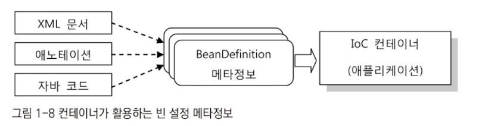

# 1장 IoC 컨테이너와 DI

## 1.1 IoC 컨테이너: 빈 팩토리와 애플리케이션 컨텍스트

- 스프링 애플리케이션은 오브젝트의 생성, 관계설정, 사용, 제거 등의 작업을 코드 대신 독립된 컨테이너가 담당함
  - 코드 대신 컨테이너가 오브젝트에 대한 제어권을 가지고 있으니 IoC임
- 스프링 IoC 컨테이너는 일반적으로 애플리케이션 컨텍스트를 말함
  - 그 자체로 IoC와 DI를 위한 빈 팩토리이몃너 그 이상의 기능을 가짐
- ApplicationContext 인터페이스는 BeanFactory 인터페이스를 상속한 서브 인터페이스임

### 1.1.1 IoC 컨테이너를 이용해 애플리케이션 만들기

- 가장 간단하게 IoC 컨테이너를 만드는 방법은 ApplicationContext 구현 클래스의 인스턴스를 만드는 것임

``` java
StaticApplicationContext ac = new StaticApplicationContext();
```

- 아무런 할 일이 없는 빈 컨테이너가 만들어짐 -> POJO 클래스와 설정 메타정보가 필요함

#### POJO 클래스

- POJO 원칙을 따라 애플리케이션 코드를 작성
- 각 POJO는 특정 기술과 스펙에서 독립적 / 의존관계에 있는 다른 POJO와 느슨한 결합을 가지도록 해야함


``` java
public class Hello {
	String name;
	Printer printer;
  
  public String sayHello() {
		return "Hello " + name;
	}
  
  public void print() {
		this.printer.print(sayHello());
	}
	
  public void setName(String name) {
		this.name = name;
	}
 
	public void setPrinter(Printer printer) {
		this.printer = printer;
	}
}

public interface Printer {
	void print(String message);
}
```

- Hello는 Printer라는 인터페이스에만 의존함


``` java
public class StringPrinter implements Printer {
	private StringBuffer buffer = new StringBuffer();
  
  public void print(String message) {
		this.buffer.append (message):
	}
  
  public String tostring() {
		return this.buffer.tostring();
	}
}

public class ConsolePrinter implements Printer {
  public void print(String message) {
  	System.out.printin(message);
  }
}
```

- 인터페이스를 각자 기능에 충실하게 구성할 수 있음
- POJO 클래스를 만들고, 결합도가 낮은 유연한 관계를 가질 수 있도록 인터페이스를 이용해 연결해주는 것까지가 IoC 컨테이너가 사용할 POJO를 준비하는 첫 단계임

#### 설정 메타정보

- 스프링의 메타정보는 XML 파일이 아님
- 스프링이 XML에 담긴 내용을 읽어서 설정 메타정보로 활용하는 건 사실이지만, 그렇다고 해서 스프링이 XML로 된 설정 메타정보를 가졌다는 말은 틀린 사실
- 스프링의 메타정보는 BeanDefinition 인터페이스로 표현된 순수한 추상 정보임
- 스프링 IoC 컨테이너, 즉 애플리케이션 컨텍스트는 바로 이 BeanDefinition으로 만들어진 메타정보를 담은 오브젝트를 사용해 IoC와 DI작업을 수행함


- 스프링 IoC 컨테이너는 설정 메타정보를 참고해서 빈 오브젝트를 생성하고, 프로퍼티나 생성자를 통해 의존 오프젝트를 주입해주는 DI 작업을 수행함


- 스프링 애플리케이션이란 POJO 클래스와 설정 메타정보를 이용해 IoC 컨테이너가 만들어주는 오브젝트의 조합

### 1.1.2 IoC 컨테이너의 종류와 사용 방법

- 스프링이 제공하는 ApplicationContext 구현 클래스의 종류

#### StaticApplicationContext

- 코드를 통해 빈 메타정보를 등록하기 위해 사용
- 실제로 사용되지는 않음, 테스트 목적으로만 참고

#### GenericApplicationContext

- 가장 일반적인 애플리케이션 컨텍스트의 구현 클래스
- 실전에서 사용될 수 있는 모든 기능을 가짐
- XML 파일과 같은 외부 리소스의 메타정보를 읽어서 사용

#### GenericXmlApplicationContext

- GenericApplicationContext에 XmlBeanDefinitionReader가 결합됨

#### WebApplicationContext

- 가장 많이 사용되는 애플리케이션 컨텍스트
- "요즘은 AnnotationConfigWebApplicationContext를 쓸걸?"


- IoC 컨테이너의 역할은 초기에 빈 오브젝트를 생성하고 DI한 후 최초로 애플리케이션 기동할 빈 하나를 제공하는 것 까지임
- 웹에서는 main()메서드를 호출할 방법이 없어서, 서블릿 컨테이너가 사용자의 요청에 매핑된 서블릿을 실행하는 방식으로 동작함


### 1.1.3 IoC 컨테이너 계층구조

- IoC 컨테이너는 애플리케이션마다 하나씩이면 충분함
- XML Pass

### 1.1.4 웹 애플리케이션의 IoC 컨테이너 구성

- 웹 애플리케이션 안에서 동작하는 IoC 컨테이너는 두 가지 방법으로 만들어짐
  - 스프링 애플리케이션의 요청을 처리하는 서블릿 안에서 만들어짐
  - 웹 애플리케이션 레벨에서 만들어짐

#### 웹 애플리케이션의 컨텍스트 계층구조

- 웹 애플리케이션 레벨에 등록되는 컨테이너를 보통 말함


- 하나의 웹 애플리케이션에 두 개의 서블릿이 존재하는 경우, 서블릿은 독립적으로 빈을 생성해서 동작하고, 루트 컨텍스트는 공유해서 사용할 수 있음


- 일반적으로는 하나만 만들어서 사용함
- 계층 구조로 만드는 이유는 전체 애플리케이션에서 웹 기술에 의존적인 부분과 그렇지 않은 부분을 구분하기 위해서임


- 간단히 웹 기술을 확장하거나 변경, 조합해서 사용할 수도 있음

#### 웹 애플리케이션의 컨텍스트 구성 방법

- 서블릿 컨텍스트와 루트 애플리케이션 컨텍스트 계층구조
  - 가장 기본적인 구성 방법
  - 웹 관련 빈은 서블릿의 컨텍스트에 두고, 나머지는 루트 애플리케이션 컨텍스트에 등록

- 루트 애플리케이션 컨텍스트 단일구조
  - 웹 프레임워크나 서비스 엔진만을 사용해서 계층을 만들 때 사용
  - 서블릿의 애플리케이션 컨텍스트도 사용하지 않음

- 서블릿 컨텍스트 단일구조
  - 스프링 외의 프레임워크나 서비스 엔진에서 스프링의 빈을 이용할 생각이 아니라면 루트 애플리케이션 컨텍스트를 생략할 수도 있음

#### 루트 애플리케이션 컨텍스트 등록

- pass

## 1.2 IoC/DI를 위한 빈 설정 메타정보 작성

- 컨테이너는 빈 설정 메타정보를 통해 빈의 클래스와 이름을 제공받음



### 1.2.1 빈 설정 메타정보

pass

### 1.2.2 빈 등록 방법

pass

#### 자동인식을 이용한 빈 등록: 스테레오타입 애노테이션과 빈 스캐너

- 한 곳에 명시적으로 선언하지 않고도 스프링 빈을 등록하는 방법
- 빈 스캐닝을 통한 자동인식 빈 등록 기능

- @Component 애노테이션을 가진 클래스를 선택하게 됨

- 하나의 빈이 등록되려면 아이디와 클래스 이름이 메타정보로 제공되어야 함

  - 클래스 이름은 간단하게 가져올 수 있음
  - 아이디는 클래스 이름의 첫 글자만 소문자로 바꾼 것을 사용함

- 빈 클래스 자동인식의 종류

  

- 각 계층의 핵심 클래스에는 해당 애노테이션을 사용하고, 특정계층으로 분류하기 힘든 경우에는 @Component를 사용하는 것이 바람직함
- 또한 직접 정의해서 사용할 수도 있음

#### 자바 코드에 의한 빈 등록: @Configuration 클래스의 @Bean 메소드

- 자바 코드를 통해 오브젝트를 생성하고 DI하는게 유용할 때가 있음

  1. 자바코드에 의한 빈 등록 기능은 하나의 클래스 안에 여러개의 빈을 정의 할 수 있음

  2. 애노테이션을 이용해 빈 오브젝트의 메타정보를 추가하는 일도 가능

  3. 그 정의를 담고 있는 클래스 자체가 자동인식 빈의 대상이 되기 때문에 XML을 통해 명시적으로 등록하지 않아도 됨

- @Configuration 애노테이션이 달린 클래스를 이용해 빈 설정 메타정보를 담을 수 있음

- @Bean이 붙은 메소드를 정의하는 것도 가능함

  - 이렇게 생성되는 빈의 설정 메타정보는 모두 디폴트 값이 자동으로 적용됨

``` java
@Configuration
public class AnnotatedHelloConfig {
	@Bean
	public AnnotatedHe110 annotatedHe110() {
		return new AnnotatedHe11o():
	}
}
```

``` java
@Component
public class HelloConfig {
	
	@Autowired
	Printer printer;
	
	@Bean
	public Hello hello(){
		Hello hello = new Hello();
		hello.setPrinter(printer());
		return hello;
	}
	
	@Bean
	public Hello hello2(){
		Hello hello = new Hello();
		hello.setPrinter(printer());
		return hello;
	}
	@Bean
	public Printer printer(){
		return new Printer();
	}
}
```

- 여러번 호출해도 매번 동일한 빈 오브젝트가 리턴되게 함
- 싱글톤 객체를 사용하기 위해서는 내부에 printer 를 DI 받아서 넣어줘야함

### 1.2.3 빈 의존관계 설정 방법

pass

#### @Resource 애노테이션

- 주입할 빈을 아이디로 지정하는 방법

``` java
public class Hello {
	private Printer printer;
  
	@Resource(name="printer") // 이름 생략 가능
	public void setPrinter(Printer printer) {
		this.printer = printer;
	}
  ...
```

- 이 방식을 필드 주입이라고 함
- 컨테이너 밖에서 수동으로 DI 할 경우 불편함


#### @Autowired/@Inject

- 또 다른 의존관계 설정 방식

- @Autowired는 XML 타입에 의한 자동와이어링 방식을 생성자, 필드, 수정자 메소드, 일반 메소드의 네 가지로 확장한 것

- 수정자 메소드와 필드

  ``` java
  public class Hell0 {
  	private Printer printer;
  	@Autowired
  	public void setPrinter(Printer printer) {
  		this.printer = printer;
  	}
  ```

- 생성자

  ``` java
  public class Bassalservice implements Salservice {
    protected SqlReader sqlReader ;
    protected SqlRegistry sqlRegistry;
    
    @Autowired
    public BassqlService(SqlReader sqlReader, SqlRegistry sqlRegistry) {
      this.sqlReader = sqlReader ;
      this.sqlRegistry = sqlRegistry;
    }
    ...
  ```

- 일반 메소드

``` java
public class Bassalservice implements Sqlservice {
  protected SqlReader sqlReader;
  protected SqlRegistry sqlRegistry;
  
  @Autowired
  public void config(SqlReader sqlReader, SqlRegistry sqlRegistry) {
    this.sqlReader = SqlReader:
    this.sqlRegistry = sqlRegistry;
  }
```

- 컬렉션과 배열

  - 같은 타입의 빈이 하나 이상 존재할 때 그 빈들을 모두 DI 받을수 있음

  - 컬렉션이나 배열로 선언해서 입력받으면 됨

    ``` java
    @Autowired
    Collection<Printer> printers;
    
    @Autowired
    Printer[] printers;
    
    @Autowired
    Map<String, Printer> printerMap;
    ```

#### @Qualifier

- 타입 외의 정보를 추가해서 자동와이어링을 세밀하게 제어할 수 있는 보조적인 방법
- 빈 선정을 도와주는 부가 정보

``` java
@Autowired
@Qualifier("mainDB")
DataSource dataSource;
```


### 1.2.4 프로퍼티 값 설정 방법

- DI를 통해 빈에 주입되는 것
  - 다른 빈 오브젝트의 레퍼런스
  - 단순 값 - 스프링에서 관리하는 빈이 아닌 모든 것

#### @Value

- 빈이 사용해야 할 단순한 값이나 오브젝트를 코드에 담지 않고 설정을 통해 런타임 시에 주입하는 방식
- 매번 달라질 수 있는 값이나, 환경에 의존적인 정보 등을 소스코드의 수정 없이 지정해주기 위해 사용
- 자바 코드 외부의 리소스나 환경정보에 담긴 값을 사용하도록 지정

### 1.2.5 컨테이너가 자동등록하는 빈

- ApplicationContext, BeanFactory
- ResourceLoader, ApplicationEventPublisher - 외부 리소스 조회, 이벤트 발행
- systemProperties, systemEnvironment - 환경변수