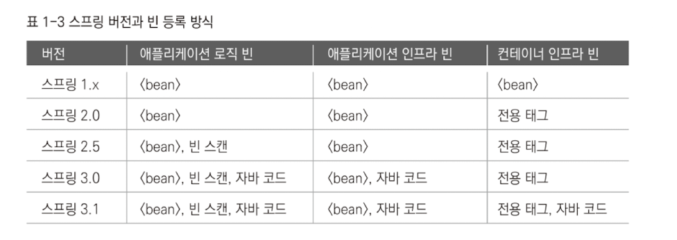

# 1장 IoC 컨테이너와  DI (2)

## 1.3 프로토타입과 스코프

- 스코프 - 존재할 수 있는 범위를 가리킴
- 빈의 스코프 - 빈 오브젝트가 만들어져 존재할 수 있는 범위
  - 스프링 컨테이너가 생명주기를 관리하기 때문에 대부분 정해진 범위의 끝까지 존재함
- 싱글톤 스코프 - 컨테이너스코프라고 함
  - 단일 컨테이너 구조에서는 컨테이너가 존재하는 범위와 일치하기 때문
  - 컨텍스트당 한 개의 오브젝트만 만들어짐
- 요청 스코프 - 하나의 요청이 끝날 때 까지만 존재함

### 1.3.1 프로토타입 스코프

#### 싱글톤 스코프

- 싱글톤 스코프 - 컨텍스트당 한 개의 빈 오브젝트만 만들어짐
  - 하나의 빈을 여러개의 빈에서 DI해도 동일한 오브젝트가 주입됨
  - DI설정으로 자동 주입하는 것 이외에 컨테이너에 getBean() 메소드로 의존객체 조회를 해도 매번 동일함

``` java
@Test
public void singletonScope() {
		ApplicationContext ac = new AnnotationConfigApplicationContext(
				SingletonBean.class, SingletonClientBean.class);
		Set<SingletonBean> beans = new HashSet<SingletonBean>();
  // set은 중복을 허용하지 않음
		
		beans.add(ac.getBean(SingletonBean.class));
		beans.add(ac.getBean(SingletonBean.class));
		assetThat(beans.size, is(1));		
  // DL에서 싱글톤 확인

		beans.add(ac.getBean(SingletonClientBean.class));
		beans.add(ac.getBean(SingletonClientBean.class));
		assetThat(beans.size, is(1));	
  // DI에서 싱글톤 확인
}

static class SingletonBean {}
static class SingletonClientBean {
		@Autowired SingletonBean bean1;
		@Autowired SingletonBean bean2;
}
```

- 항상 동일한 오브젝트가 돌아옴

#### 프로토타입 스코프

- 매번 요청할 때마다 새로운 오브젝트를 생성함

``` java
@Test
public void prototypeScope() {
		AppliocationContext ac = new AnnotationConfigApplicationContext(
				PrototypeBean.class, PrototypeClientBean.class);
		Set<PrototypeBean> bean = new HashSet<PrototypeBean>();

		bean.add(ac.getBean(PrototypeBean.class));
		assetThat(bean.size(), is(1));
		bean.add(ac.getBean(PrototypeBean.class));
		assertThat(bean.size(), is(2));
		bean.add(ac.getBean(PrototypeClientBean.class));
		assetThat(bean.size(), is(3));
		bean.add(ac.getBean(PrototypeClientBean.class));
		assertThat(bean.size(), is(4));
  // 매번 다른 오브젝트가 만들어짐
}

@Scope("prototype")
static class PrototypeBean {}

static class PrototypeClientBean {
		@Autowired PrototypeBean bean1;
		@Autowired PrototypeBean bean2;
}
```

- DI던 DL이던 매번 새로운 오브젝트가 만들어짐

#### 프로토타입 빈의 생명주기와 종속성

- 스프링이 관리하는 빈은 모든 생명주기를 컨테이너가 관리함
  - 빈에 대한 정보와 오브젝트에 대한 레퍼런스는 컨테이너가 계속 가지고 필요할 때마다 얻어옴

- 프로토타입 빈은 IoC 원칙을 따르지 않음
  - 생성 초기화, DI까지만 제공함
  - 일단 빈을 제공하면 컨테이너는 더 이상 빈 오브젝트를 관리하지 않음
  - DL이나 DI를 통해 컨테이너 밖으로 전달된 후에는 더이상 스프링이 관리하지 않음
  - 빈 오브젝트의 관리는 전적으로 DI받은 오브젝트에 달림
  - 주입받은 오브젝트에 종속적으로 생명주기를 따라갈 것임

#### 프로토타입 빈의 용도

- 대부분은 싱글톤 빈으로 만들고 사용자별로 따로 가지지 않게 해도 충분함
- 프로토타입은 코드에서  new로 오브젝트를 생성하는 것을 대신하기 위해 사용됨
- 일반적으로 new 키워드나 팩토리로 코드 안에서 오브젝트를 만들고 이걸로 충분함
- 하지만 DI시에는 컨테이너가 오브젝트를 만들고 초기화해야함
- 요청에 따라 매번 독립적인 오브젝트를 만들어야 하는데, 매번 새롭게 만들어지는 오브젝트가 컨테이너 내의 빈을 사용해야하는 경우가 있음
- 오브젝트에 DI를 적용하려면 컨테이너가 오브젝트를 만들게 해야하고, 이 과정에서 프로토타입 빈을 사용함
- 생성과 DI작업까지 다 마친 후 돌려주기 때문에


- 콜센터 고객의 A/S 신청을 받아 접수

``` java
public class ServiceRequest {
		String customerNo;
		String productNo;
		String description;
		...
}

public void serviceRequestFormSubmit(HttpServletRequest request) {
		//매번 ServiceRequest객체를 생성
		ServiceRequest serviceRequest = new ServiceRequest();
		serviceRequest.setCustomerNo(request.getParameter("custno")); 
		...

		this.serviceRequestService.addNewServiceRequest(serviceRequest);
		...
}

public void addNewServiceRequest(ServiceRequest serviceRequest) {
		Customer customer = this.customerDao.findCustomerByNo(
				serviceRequest.getCustomerNo());
		...
		this.serviceRequestDao.add(serviceRequest, customer);

		this.emailService.sendEmail(customer.getEmail(), 
				"A/S 접수가 정상적으로 처리되었습니다.");	
}
```

- 매번 ServiceRequest를 만들어서 사용함


- 해당 방식의 장점
  - 처음 설계하고 만들기에는 편함
- 단점
  - 폼의 고객정보 입력 방법이 모든 계층의 코드와 강하게 결합되어 있음

-> 오브젝트 중심의 구조로 변경하는 게 좋음

``` java
public class ServiceRequest {
		Customer customer; // 객체를 가지도록 변경
		String productNo;
		String description;
		...
}

public void addNewServiceRequest(ServiceRequest serviceRequest) {
		this.serviceRequestDao.add(serviceRequest);
		this.emailService.sendEmail(serviceRequest.getCustomer().getEmail(), 
				"A/S 접수가 정상적으로 처리되었습니다.");
}
```

- 입력받은 고객번호로 고객을 찾아오는 작업 생략
- serviceRequestDao에도  ServiceRequest 타입의 오브젝트만 전달하면 됨
- 이제 Customer 객체로 변환만 하면 됨

``` java
public class ServiceRequest {
		Customer customer;
		...
		@Autowired CustomerDao customerDao;
		
		public void setCustomerByCustomerNo(String customerNo) {
				this.customer = customerDao.findCustomerByNo(customerNo);
		}
}
```

- 컨트롤러에서 new 키워드로 생성하는 ServiceRequest 오브젝트에 DI해서 Customer DAO를 주입

- ServiceRequest를 사용하는 서비스 계층이나 DAO 코드는 영향을 받지 않음

``` java
// 프로토타입 스코프 빈을 이용
@Component
@Scope("prototype")
public class ServiceRequest {
	...
    
}
// 요청할 때마다 새로운 오브젝트를 생성하고 처리함
@Autowired ApplicationContext context;

public void serviceRequestFormSubmit(HttpServletRequest request) {
		ServiceRequest serviceRequest = this.context.getBean(ServiceRequest.class);
  // getBean으로 요청하면 prototype이므로 새로운 오브젝트를 반환함
		serviceRequest.setCustomerByCustomerNo(request.getParameter("custno"));
}
```

- 애플리케이션 컨텍스트에서 가져온 ServiceRequest는 CustomerDao가 DI된 상태

``` java
// 이제 자유롭게 DI 받을 수 있으니 EmailService를 넣어도 됨
public class ServiceRequest {
		Customer customer;
		@Autowired EmailService emailService;
		...
		
		public void notifyServiceRequestRegistration() {
				if(this.customer.serviceNotificationMethod == NotificationMethod.EMAIL) {
						this.emailService.sendEmail(customer.getEmail(),
								"A/S 접수가 정상적으로 처리되었습니다.");
				}
		}
		...
}

// Service 계층의 코드
public void addNewServiceRequest(ServiceRequest serviceRequest) {
		this.serviceRequestDao.add(serviceRequest);
		serviceRequest.notifyServiceRequestRegistration();
}

```


#### DI와  DL

- DL은 ApplicationContext로 getBean()을 호출하는 것

``` java
@Autowired ServiceRequest serviceRequest;

public void serviceRequestFormSubmit(HttpServletRequest request) {
		this.serviceRequest.setCustomerNo(request.getParameter("custno"));
		...
}
```

- getBean을  DI로 변경
- 정답처럼 보이지만, DI는 싱글톤이기 때문에 처음 만들어질 때에만 진행됨
- 빈을 프로토타입으로 만들었어도 새로운 ServiceRequest 오브젝트를 만들지 않고 컨테이너에 요청할 때 한번만 생성함
- 여러 사용자가 동시에 요청을 보내면 ServiceRequest가 공유되게 됨
- new를 대신하려면 DL방식을 사용해야함


#### 프로토타입 빈의  DL 전략

1. ApplicationContext, BeanFactory

   - @Autowired, @Resource를 사용해서 DI받은 뒤  getBean()으로 빈을 가져오는 방식
   - 스프링 API가 직접 등장한다는 단점이 존재함

2. ObjectFactory, ObjectFactoryCreatingFactoryBean

   - 중간 컨텍스트에 getBean()을 호출하는 역할을 맡을 오브젝트를 두면 됨

   - 팩토리 이용

     - 오브젝트를 요구하면서 어떻게 생성하거나 가져오는지 신경쓰지 않아도 됨
     - 원하는 프로토타입 빈을 가져오는 방식으로 동작하는 팩토리를 만들어서 빈으로 등록
     - 빈을  DI받아서 필요할 때 getObject()로 호출해서 가져오게 함
     - 
     - 코드가 깔끔해지고, 테스트에서 사용하기도 편함

     ``` java
     ObjectFactory<ServiceReqeust> factory = ...;
     ServiceReqeust request = factory.getObject();
     ```

     - ObjectFactory 인터페이스는 타입 파라미터와  getObject를 가짐

     ``` java
     @Configuration
     public class ObjectFactoryConfig {
     		@Bean
     		public ObjectFactoryCreatingFactoryBean serviceRequestFactory() {
     				ObjectFactoryCreatingFactoryBean factoryBean = 
     						new ObjectFactoryCreatingFactoryBean();
     				factoryBean.setTargetBeanName("serviceRequest");
     				return factoryBean;
     		}
     }
     ```

     - 이런 코드로 빈을 등록할 수 있음

     

3. ServiceLocatorFactoryBean

   - ObjectFacotry처럼 스프링이 정의한 인터페이스를 사용하지 않아도 됨

     ``` java
     public interface ServiceRequestFactory {
     		ServiceRequest getServiceFactory();
     }
     
     // Bean 등록은 Config로 하면 됨
     // Autowired로 타입을 가져오는 것이 가능함
     @Autowired ServiceRequestFactory serviceRequestFactory;
     
     public void serviceRequestFormSubmit(HttpServletRequest request) {
     		ServiceReqeust serviceRequest = 
     				this.serviceRequestFactory.getServiceFactory();
     
     		serviceRequest.setCustomerByCustomerNo(request.getParameter("custno"));
     }
     ```

4. 메소드 주입

   - @Autowired를 메소드에 붙여서 메소드 파라미터에 의해 DI되게 하는 방식이 아님
   - 메소드 코드 자체를 주입하는 것!

5. Provider<T>

   - 가장 최근에 소개된 방식
   - <T>타입 파라미터와 get()을 가짐
   - ObjectFactory와 유사하지만 ObjectFactoryCreatingFacotryBean을 등록하지 않아도 되어 사용이 편리함

   

### 1.3.2 스코프

#### 요청 스코프

- 하나의 웹 요청 안에서 만들어지고 끝날 때 제거됨
- 여러 사용자가 많은 요청을 보내도 안전

#### 세션, 글로벌세션 스코프

- HTTP 세션과 같은 존재 범위를 가지는 빈으로 만들어주는 스코프
- 사용자별로 만들어지고 로그인 정보나 사용자별 선택옵션을 저장하기에 유용함
- 직접 이용하는건 매우 번거로움

#### 애플리케이션 스코프

- 서블릿 컨텍스트에 저장되는 빈 오브젝트
- 상태를 가지지 않거나, 가지더라도 읽기 전용이거나, 멀티스레드 환경에서 안전해야함

#### 사용방법

``` java
@Scope("session")
public class LoginUser {
		String loginId;
		String name;
		Date loginTime;
		...
}
```

#### 커스텀 스코프와 상태를 저장하는 빈 사용하기

- 임의의 스코프를 만들어서 사용할 수 잇음
- 일정한 작업 단위동안 유지되는 정보를 저장해두는 용도로 사용하면 편리함


## 1.4 기타 빈 설정 메타정보

### 1.4.1 빈 이름

#### 어노테이션에서의 빈 이름

- @Component같은 스테레오타입의 어노테이션을 부여하고 자동 인식되게 하면 클래스 이름을 맨 앞글자만 소문자로 바꿔서 이름으로 사용함

  ``` java
  //userService가 빈 이름으로 지정
  
  @Component
  public class UserService {
  ```

  

- @Configuration이 달린 클래스의 @Bean 메소드를 이용해 빈을 정의하는 경우 메소드 이름이 그대로 빈 이름으로 지정

  ```java
  //userDao라는 이름의 빈이 생성
  
  @Configuration
  public class Config {
  		@Bean
  		public UserDao userDao() {
  ```

- 자동 빈 스캔 대상이라면 애노테이션의 디폴트 앨리먼트 값으로 이름 지정 가능

  ``` java
  @Component("myUserService")
  public class UserService {
  ```

- JSR-330의 @Named 애노테이션을 사용해서 이름 지정 가능

  ``` java
  @Component
  @Named("myUserService")
  public class UserService {
  ```

- 자바 코드를 이용한 빈 등록 방식에선 @Bean 애노테이션의 name 앨리먼트를 이용

  ```java
  @Configuration
  public class Config {
  		@Bean(name="myUserDao")
  		public UserDao userDao() {
  
  
  // 여러개 등록
  @Bean(name={"myUserDao", "userDao"})
  public UserDao userDao() {
  
  ```

- @Named와  @Component의 이름이 다르면 예외가 발생함

### 1.4.2 빈 생명주기 메소드

#### 초기화 메소드

- 빈 오브젝트가 생성되고 DI작업까지 마친 다음 실행되는 메소드

1. 초기화 콜백 인스턴스
   - InitializingBean 인터페이스를 구현하여 빈을 작성
   - 권장 X (빈 코드에 스프링 인터페이스를 노출함)
2. init-method 지정
   - XML
3. @PostConstruct
   - 초기화를 담당할 메소드에 @PostConstruct 애노테이션 부여
   - 직관적
4. @Bean(init-method)
   - @Bean 애노테이션의 init-method 엘리먼트 사용 가능

#### 제거 메소드

1. 제거 콜백 인터페이스
2. destroy-method
3. @PreDestroy
4. @Bean(destroyMethod)


### 1.4.3 팩토리 빈과 팩토리 메소드

- 생성자 대신 오브젝트를 생성해주는 코드의 도움을 받아서 빈 오브젝트를 생성하는 것을 팩토리 빈이라 부름

#### FactoryBean 인터페이스

- FactoryBean 인터페이스를 구현해서 getObject() 메소드를 구현
- 가장 단순하고 자주 사용됨

#### 스태틱 팩토리 메소드

- 클래스의 스태틱 메소드를 호출해서 인스턴스를 생성하는 방식
- 다양한 기술 API에서 사용됨

#### 인스턴스 팩토리 메소드

- 오브젝트의 인스턴스 메소드를 이용하는 방식
- 팩토리 빈이 대표적인 방법

#### @Bean 메소드

- 이것도 일종의 팩토리 메소드임


## 1.5 스프링 3.1의 IOC 컨테이너와 DI

- 스프링 3.1에 새롭게 도입된 IoC/DI 기술은 두가지

  - 강화된 자바 코드 빈 설정

  - 런타임 환경 추상화

- 자바 코드를 이용한 설정 메타정보 작성이 쉬움
- XML 사용하지 않거나 최소화한 채로 개발 가능


### 1.5.1 빈의 역할과 구분

#### 빈의 종류

##### 애플리케이션 로직 빈

- IoC/DI 컨테이너에 의해 생성되고 관리되는 오브젝트

##### 애플리케이션 인프라 빈

- DataSource같은 것들
- 구현 클래스가 여러가지여서 하나를 지정하고 연결 방법은 외부에서 제공하는 경우

##### 컨테이너 인프라 빈

- AOP를 설명하면서 소개했던 DefaultAdvisorAutoProxyCreator
- 로직과 별도로 동작하는 느낌
- 스프링 컨테이너의 기능에 관여하며 빈을 생성할 때 프록시 생성같은 특별한 작업 지원

#### 빈의 역할

- ROLE_APPLICATION
  - 애플리케이션 로직/인프라 빈처럼 동작 중에 사용되는 빈
- ROLE_SUPPORT
  - 복합 구조의 빈을 정의할 때 보조적으로 사용 (거의 사용하지 않음)
- ROLE_INFRASTRUCTURE
  - <context:annotation-config> 같은 전용 태그의 의해 등록되는 컨테이너 인프라 빈들을 의미


### 1.5.2 컨테이너 인프라 빈을 위한 자바 코드 메타정보

#### IoC DI 설정 방법의 발전

- 스프링 1.x

  - XML을 사용한 빈 등록

- 스프링 2.0

  - 의미있는 스키마, 네임스페이스를 가진 전용 태그를 제공
  - 커스텀 태그도 존재

- 스프링 2.5

  - 빈 스캐너, 스테레오타입 애노테이션을 이용한 빈 자동등록 방식과 애노테이션 기반의 의존관계 설정 방법 등장
  - @Component류의 애노테이션으로 빈 등록됨

- 스프링 3.0

  - 자바 코드로 빈 설정정보, 코드를 만드는 일이 가능해짐
  - DataSource와 같은 인프라 빈은 쉽게 등록 가능
  - 컨테이너 인프라 빈 등록에는 XML이 필요했음

- 스프링 3.1

  - 컨테이너 인프라 빈도 자바 코드로 등록 가능

  

#### 자바 코드를 이용한 컨테이너 인프라 빈 등록 (3.1에서)

- @ComponentScan

  - Configuration이 붙은 클래스에 추가하면 스테레오타입 애토테이션이 붙은 빈을 자동으로 스캔해서 등록해줌
    - Controller, Service, Repository

  ``` java
  @Configuration
  @ComponentScan("springbook.learningtest.spring31.ioc.scanner")
  public class AppConfig {}
  ```

  - 기본값은 빈을 스캔할 기반 패키지임
  - 패키지 여러개 지정 가능, 마커 클래스나 인터페이스도 가능

  ``` java
  public interface ServiceMarker {}
  
  @Configuration
  @ComponentScan(basePackageClasses=ServiceMarker.class)
  public class AppConfig {}
  ```

  - 실수가 적어짐
  - 스캔할 페이지를 제외하고싶을 때 exclude 엘리먼트 사용

  ``` java
  //패키지 예시
  myproject
  		-- config
  		-- dao
  		-- service
  		-- web
  ```

  - @Configuration이 붙은 클래스에서 @ComponentScan을 이용하는데 자기 자신이 다시 스캔되면 곤란함

  ``` java
  // @Filter 사용
  @Configuration
  @ComponentScan(basePackages="myproejct", 
  		excludeFilters=@Filter(Configuration.class)
  )
  public class AppConfig {}
  ```

- @Import

  - @Configuration 클래스를 빈 메타정보에 추가할 때 사용

  - 특정 클래스의 빈 정보를 포함하고 싶을 때 사용

    ``` java
    @Configuration
    @Import(DataConfig.class)
    public class AppConfig {
    }
    
    @Configuration
    public class DataConfig {
    }
    ```

- @ImportResource

  - XML 파일의 빈 설정 가져오기 가능

- @EnableTransactionManagement

  - @Configuration 클래스에 사용 가능
  - @Transactional로 트랜잭션 속성을 지정할 수 잇게 해주는 AOP 관련 빈을 등록해줌ㅛ

### 1.5.3 웹 애플리케이션의 새로운 IoC 컨테이너 구성

pass

### 1.5.4 런타임 환경 추상화와 프로파일

#### 환경에 따른 빈 설정정보 변경 전략과 한계

- 애플리케이션이 실행되는 환경이 달라지면 일부 빈은 환경에 맞게 설정 메타정보를 다르게 구성해야 함

##### 빈 설정파일의 변경

- 메타정보를 담은  XML이라 클래스를 준비하는 방식
  - 각 환경에서 다른 파일을 사용함
  - 데이터가 지속적으로 달라진다면 번거롭고 위험함

##### 프로퍼티 파일 활용

- 환경에 따라 달라지는 정보를 담은 프로퍼티 파일을 활용할 수 있음
- XML이나 @Configuration 클래스는 애플리케이션 로직이 바뀌지 않는 한 건드리지 않고 환경에 따라 달라지는 외부 정보만 프로퍼티 파일 등에 두고 사용

- XML에 DataSource 클래스로 빈을 등록하고 실제 속성에 넣을 값은 프로퍼티 파일에서 읽어서 지정하도록 프로퍼티 치환자를 사용해서 정의


환경에 따라 아예 빈 클래스가 바뀌거나 빈 구성이 달라지는 경우는 이렇게 할 수 없음

#### 런타임 환경과 프로파일

- 런타임 환경: 애플리케이녓 컨텍스트에 새롭게 도입된 개념
- 컨텍스트 내부에  Environment 인터페이스를 구현한 런타임 환경 오브젝트가 만들어져서 빈을 생성하거나 의존관계를 주입할 때 사용
- 프로파일
  - 다른 이름을 가진 프로파일 안에 저장하고, 활성화된 프로파일을 사용함

#### 활성 프로파일 지정 방법

- -Dspring.profiles.active=dev로 지정할 수 있음


@Configuration이 붙은 클래스를 이용해 빈을 정의하는 경우에도 프로파일을 지정할 수 있음

``` java
@Configuration
@Profile("dev")
public class DevConfig {
		...
}
```


### 1.5.5 프로퍼티 소스

- 프로퍼티 - 키와 대응하는 값의 쌍을 말함
- 사용되는 프로퍼티 종류
  - 환경변수
  - 시스템 프로퍼티
  - JNDI
  - 서블릿 컨텍스트 파라미터
  - 서블릿 컨픽 파라미터


#### 프로퍼티 소스의 사용

##### Environment.getProperty()

- 가장 간단한 방법은 Environment를 빈에 주입해서 가져오는것임

```
@Autowired Environment env;
```

- env.getProperty()를 이용하면 주어진 키에 해당하는 프로퍼티 값을 가져옴

```
String serverOS = env.getProperty("os.name");
```

- 해당 빈에서 반복적으로 사용해야한다면 @PostConstruct를 이용해 클래스 멤버 필드에 미리 프로퍼티 값을 저장

```
@Autowired Environment env;
private String adminEmail;

@PostConstruct
public void init() {
		this.admninEmail = env.getProperty("admin.email");
}
```

- DataSource 빈을 만들 때 필요한 프로퍼티 정보를 주입해주는 방법


## 1.6 정리

- 스프링 애플리케이션은 POJO 클래스와 빈 설정 메타정보로 구성된다.
- 빈 설정 메타정보는 특정 포맷의 파일이나 리소스에 종속되지 않는다. 필요하다면 새로운 설정정보 작성 방법을 얼마든지 만들어 사용할 수 있다.
- 스프링의 빈 등록 방법은 크게 XML과 빈 자동인식, 자바 코드 세 가지로 구분할 수 있다.
- 스프링의 빈 의존관계 설정 방법은 XML과 애노테이션, 자바 코드로 구분할 수 있다.
- 프로퍼티 값은 빈에 주입되는 빈 오브젝트가 아닌 정보다.
- 프로퍼티 값 중에서 환경에 따라 자주 바뀌는 것은 프로퍼티 파일과 같은 별도의 리소스 형태로 분리해놓는 것이 좋다
- 빈의 존재 범위인 스코프는 싱글톤과 프로토타입 그리고 기타 스코프로 구분할 수 있다.
- 프로토타입과 싱글톤이 아닌 스코프 빈은 DL 방식을 이용하거나, 스코프 프록시 빈을 DI 받는 방법을 사용해야 한다.
- 스프링 3.1은 애노테이션과 자바 코드를 이용한 빈 메타정보 작성 기능을 발전시켜서 자바 코드만으로도 스프링 애플리케이션의 모든 빈 설정이 가능하게 해준다.
- 스프링 3.1의 프로파일과 프로퍼티 소스로 이뤄진 런타임 환경 추상화 기능을 이용하면 환경에 따라 달라지는 빈 구성과 속성 지정 문제를 손쉽게 다룰 수 있다.