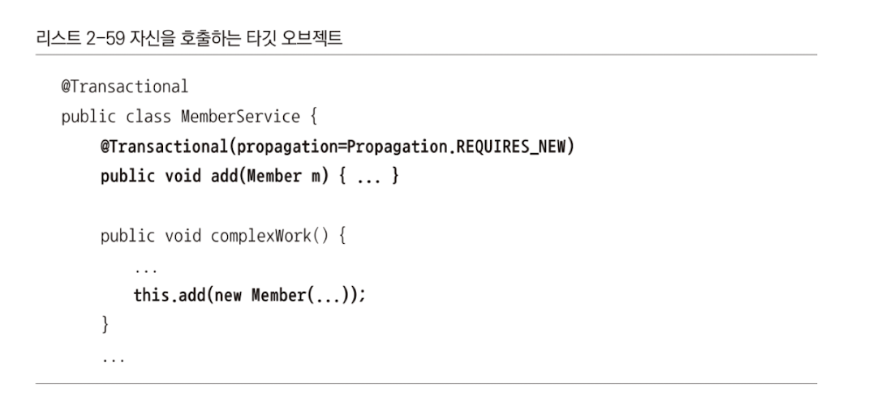

# 2장 데이터 액세스 기술

## 2.1 공통 개념

### 2.1.1 DAO 패턴

- 데이터 액세스 계층은 DAO패턴이라 불리는 방식으로 분리하는 것이 원칙
- 비즈니스 로직이 없거나 단순하면 DAO와 서비스 계층을 통합할 수도 있음
- DAO 패턴
  - DTO 또는 도메인 오브젝트만을 사용하는 인터페이스를 통해 데이터 액세스 기술을 외부에 노출하지 않도록 만드는 것
  - 구현 기술에 대한 정보를 외부에 공개해서는 안됨
  - DAO를 이용하는 서비스 계층의 코드를 기술이나 환경에 종속되지 않는 순수한 POJO로 개발할 수 있음
  - 언제나 목 오브젝트와 같은 테스트 대역 오브젝트로 대체해서 단위 테스트를 작성할 수도 있음

#### DAO 인터페이스와 DI

- DAO는 인터페이스를 이용해 접근하고 DI 되도록 만들어야함
  - 구체적인 데이터 액세스 기술과 관련된 어떤 API나 정보도 노출하지 않기 때문
- 습관적으로 DAO 클래스의 모든 public 메소드를 추가하지 않도록 주의해야함
  - 의미 있는것들만 공개
- 특정 데이터 액세스 기술에서만 의미 있는 DAO 메소드의 이름은 피하기
  - persist, merge같은거 말고, add나 update같은 이름 선택

#### 예외처리

- DAO 밖으로 던져질 때는 런타임 에러여야함 -> 대부분 복구할 수 없기 때문에
- DAO 메소드 선언부에 throws SQLException과 같은 내부 기술을 드러내는 예외를 직접 노출해서도 안됨
- 서비스 계층은 DAO가 던지는 대부분의 예외는 직접 다뤄야 할 이유가 없음
  - 하지만 중복키 예외나 각 낙관적인 락킹의 경우는 적용하는 경우가 있음
- 데이터 액세스 기술에서 일관성을 유지시켜주는 JdbcTemplate가 존재함
  - API를 직접 사용할 때에는 AOP를 사용해서 예외를 전환해주는 기능을 사용하면 됨
- 최신 데이터 액세스 기술은 JDBC와는 다르게 런타임 예외를 사용함
  - 일관된 예외 복구 기능을 적용할 필요가 없다면 굳이 스프링 예외 변환 서비스를 이용하지 않아도 됨

### 2.1.2 템플릿과 API

- 스프링은 DI의 응용 패턴인 템플릿/콜백 패턴을 이용해 이런 판에 박힌 코드를 피하고 꼭 필요한 바뀌는 내용만을 담을 수 있도록 데이터 액세스 기술을 위한 템플릿을 제공함
  - 반복되는 코드 제거 / 예외 변환 / 트랜잭션 동기화 기능 모두 제공
  - 하지만 템플릿이 제공하는 API를 제공해야한다는 단점이 존재하기는 함
  - 그래서 해당 기술의 API로 그대로 사용하게 하는 방법도 존재함

### 2.1.3 DataSource

- JDBC를 통해 DB를 연결하려면 Connection 타입의 DB 연결 오브젝트가 필요함
- Connection -> 모든 데이터 액세스 기술에서 사용되는 필수 리소스
  - DB 커넥션을 풀에 준비하고 요청할 때마다 할당해주는 풀링 기법을 이용함
- Spring에서는 DataSource를 하나의 독립된 빈으로 등록하도록 강력하게 권장함
  - 스프링 데이터 액세스 기술의 다양한 서비스에서 DataSoruce를 필요로하기 때문에 공유 가능한 빈으로 등록해야함
- 다중 사용자를 가지는 시스템에서는 반드시 DB 연결 풀 기능을 지원하는 DataSource를 사용해야 함

#### 학습 테스트와 통합 테스트를 위한 DataSource

##### SimpleDriverDataSource

- 스프링이 제공하는 가장 단순한 DataSource 구현 클래스
- 따로 풀을 관리하지 않고 요청할 때마다 새로 만듬
- 실전에서는 사용하면 안됨

##### SingleConncectionDataSource

- 하나의 물리적인 DB 커넥션만 만들고 계속 사용하는 방식
- 두 개 이상의 스레드가 동작하는 경우 위험함
- 위보다 빠르게 동작함

#### 오픈소스 또는 상용 DB 커넥션 풀

##### 아파치 Commons DBCP

- 가장 유명한 오픈소스 DB 커넥션 풀 라이브러리

##### c3p0 JDBC/DataSource Resource Pool

- JDBC 3.0 스펙을 준수하는 Conncetion과 Statement 풀을 제공하는 라이브러리

##### 상용 DB 커넥션 풀

#### JDNI/WAS DB 풀

- 대부분의 자바 서버는 자체적으로 DB 풀 서비스를 제공함
  - 애플리케이션 레벨의 전용 풀을 만드는 대신 서버가 제공하는 DB 풀을 사용해야하는 경우 JNDI로 접근해야함

## 2.2 JDBC

- 자바의 데이터 액세스 기술의 기본이 되는 로우레벨의 API
- 표준 인터페이스를 제공하고 각 DB 벤더와 개발팀에서 이 인터페이스를 구현한 드라이버를 제공하는 방식으로 사용됨
  - SQL의 호환성만 유지한다면 JDBC로 개발한 코드는 DB가 변경되어도 그대로 사용 가능
- 엔티티 클래스와 애노테이션을 이용하는 최신 ORM도 내부적으로는 DB 연동을 위해 JDBC를 이용함

스프링 JDBC

- JDBC 개발의 장점과 단순성을 유지
  - 기존 JDBC API 사용 방법의 단점을 템플릿/콜백 패턴을 이용해 극복할 수 있게 해줌
  - 가장 간결한 형태의 API 사용법 제공
  - JDBC API에서 지원되지 않는 편리한 기능을 제공

### 2.2.1 스프링 JDBC 기술과 동작원리

#### 스프링의 JDBC 접근 방법

##### SimpleJdbcTemplate

- JdbcTemplate와 NamedParameterJdbcTemplate에서 가장 많이 사용되는 기능을 통합하고 자바 5 이상의 장점을 최대한 활용할 수 있게 만든 것
- 방대한 템플릿 메소드 제공
- 내장된 콜백 제공

##### SimpleJdbcInsert, SimpleJdbcCall

- DB가 제공해주는 메타정보를 활용해서 최소한의 코드만으로 단순한 JDBC코드를 작성하게 해줌
- 메타정보에서 컬럼 정보와 파라미터 정보를 가져와서 삽입용 SQL과 프로시저 호출 작업에 사용해줌

-> Deprecated됨

#### 스프링 JDBC가 해주는 작업

##### Connection 열기/닫기

- 스프링 JDBC가 필요한 시점에 트랜잭션 기능과 맞물려서 알아서 진행
- 트랜잭션 경계를 어떻게 선언하고 호출했는지에 따라 열고 닫는 위치가 달라짐

##### Statement 준비/닫기

- 스프링 JDBC의 몫
- Statement를 사용하는 코드는 많지 않음. 이미 만들어 놓은 것을 사용하기 때문에

##### Statement 실행

##### ResultSet 루프

- 쿼리 실행 결과가 1건 이상이라면 루프를 돌면서 각 로우에 대해 처리가 필요함
- 로우의 내용을 어떻게 오브젝트에 담을 것인지는 루프 안에서 실행되는 콜백으로 만들어 템플릿에 제공

##### 예외처리와 변환

##### 트랜잭션 처리

- 트랜잭션 동기화 기법을 이용해 선언적 트랜잭션 기능과 맞물려 실행
- 트랜잭션을 시작한 후 스프링 JDBC의 작업을 요청하면 진행 중인 트랜잭션에 참여
- 트랜잭션이 없는 채로 호출된 경우 새로운 트랜잭션을 만들어서 사용

### 2.2.2 SimpleJdbcTemplate

- 스프링 JDBC에서 가장 많이 이용하게 될 JDBC용 템플릿
- 실행, 조회, 배치의 세 가지 작업으로 구분됨
  - 실행 - INSERT, UPDATE와 같이 DB의 데이터 변경이 일어나는 작업
  - 조회 - SELECT를 이용해 결과를 가져오는 작업
  - 배치 - 하나 이상의 실행 작업을 한 번에 수행해줘야하는 작업

#### SimpleJdbcTemplate 생성

- Datasource를 파라미터로 해서 생성 -> Datasource는 빈을 받아서 생성 후 사용
- 관례적으로 DAO에서 Datasource를 받아서 SimpleJdbcTemplate를 생성하는 방식을 선호함
  - DataSource가 있으면 다른 스프링 JDBC 오브젝트를 만들어 사용이 가능하기 때문
  - 애노테이션 방식을 이용한다면 @Autowired나 @Resource를 붙이거나 메소드에 의한 주입 방법이나 생성자 주입을 이용해서도 사용 가능

#### SQL 파라미터

- SQL에 매번 달라지는 값이 있는 경우에는 '?' 와 같은 치환자를 넣어 파라미터 바인딩 방법을 사용하는 것이 편리함
- 치환자를 사용하는 경우 파라미터 개수가 많으면 실수하기 쉬우며 순서 변경, 추가, 삭제가 어려움
- 맵이나 오브젝트에 담긴 내용을 키 값이나 프로퍼티 이름을 이용해 바인딩 할 수 있음

##### Map/MapSqlParameterSource

```java
Map<String, Object> map = new HashMap<String, Object>();
map.put("id", 1);
map.put("name", "Spring");
map.put("point", 3.5);
```

- 이름 치환자를 가진 SQL과 함께 SimpleJdbcTemplate에 전달되어 바인딩 파라미터로 사용 가능
- 코드를 이용해 맵에 정보를 직접 넣어야한다면 Map대신 스프링 JDBC의 MapSourceParameterSource를 사용하는 것이 편리

``` java
MapSqlParameterSource params = new MapSqlParameterSource()
                              .addValue("id", 1)
                              .addValue("name", "Spring")
                              .addValue("point", 3.5);
```


##### BeanPropertySqlParameterSource

- Map대신 도메인 오브젝트나 DTO를 사용하게 해줌
- 이름만 같게 만들면 매우 편리함

``` java
public class Member {
		int id;
		String name;
		double point;

		public int getId() {return this.id;}
		...
}


Member member = new Member(1, "Spring", 3.5);
BeanPropertySqlParameterSource params = new BeanPropertySqlParameterSource(member);
```


#### SQL 실행 메소드

- INSERT, UPDATE, DELETE를 할 때에는 SimpleJdbcTemplate의 update()를 사용함
- update()를 호출할 때에는 SQL과 함께 바인딩할 파라미터를 다음 세 가지 방식 중 하나로 전달됨

##### varargs

- 위치 치환자, 가변인자로 필요없으면 생략 가능

``` java
simpleJdbcTemplate.update(
		"INSERT INTO MEMBER(ID, NAME, POINT, args) VALUES(?,?,?)", 1, "Spring", 1.5);
```

##### Map

- 이름 치환자, Map 사용

``` java
simpleJdbcTemplate.update(
		"INSERT INTO MEMBER(ID, NAME, POINT, args) VALUES(:id, :name, :point)", map);
```

##### SqlParameterSource

- 도메인 오브젝트나 DTO를 직접 바인딩, BeanPropertySqlParameterSource사용

``` java
simpleJdbcTemplate.update(
		"INSERT INTO MEMBER(ID, NAME, POINT, args) VALUES(:id, :name, :point)",
		new BeanPropertySqlParameterSource(member));
```


#### SQL 조회 메소드

- 단순 값이나 오브젝트를 가져오는 경우와 리스트를 가져오는 경우로 구분됨

##### int queryForInt(String sql, [SQL 파라미터])

##### long queryForLong(String sql, [SQL 파라미터])

##### <T> T queryForObject(String sql, Class<T> requiredType, [SQL 파라미터])

##### <T> T queryForObject(String sql, RowMapper<T> rm, [SQL 파라미터])

##### <T> List<T> query(String sql, RowMapper<T> rm, [SQL 파라미터])

##### Map<String, Object> queryForMap(String sql, [SQL 파라미터])

##### List<Map<String, Object>> queryForList(String sql, [SQL 파라미터])

#### SQL 배치 메소드

- update()로 실행하는 SQL들을 배치 모드로 실행하게 해줌
- 많은 SQL을 실행해야 하는 경우 사용

##### int[] batchUpdate(String sql, Map<String, ?>[] batchValues)

##### int[] batchUpdate(String sql, Sql Parameter Source[] batchArgs)

##### int[] batchUpdate(String sql, List<Object[]> batchArgs)

### 2.2.3 SimpleJdbcInsert

- SQL을 이용하는 프로그래밍의 귀찮은 일은 비슷한 구조의 SQL을 반복적으로 만드는 것임
- DB의 메타정보로 INSERT문의 작성을 간편하게 해줌

#### SimpleJdbcInsert 생성

##### SimpleJdbcInsert withTableName(String tableName)

##### SimpleJdbcInsert withSchemaName(String schemaName), SimpleJdbcInsert withCatalogName(String catalogName)

##### SimpleJdbcInsert usingColumns(String... columnNames)

##### SimpleJdbcInsert usingGeneratedKeyColumns(String... columnNames)

##### SimpleJdbcInsertOperations withoutTableColumnMetaDataAccess()

#### SimpleJdbcInsert 실행

##### int execute([이름 치환자 SQL 파라미터])

- 이름 치환자를 가진 INSERT문
- 해당 오브젝트는 재사용 가능

##### Number executeAndReturnKey([이름 치환자 SQL 파라미터])

##### KeyHolder executeAndReturnKeyHolder([이름 치환자 SQL 파라미터])

### 2.2.4 SimpleJdbcCall

- DB에 생성해둔 저장 프로시저, 저장 펑션을 호출할 때 사용
- 멀티스레드 환경에 안전하여, 인스턴스 변수에 저장해두고 공유해서 사용 가능

#### SimpleJdbcCall 생성

##### SimpleJdbcCallOperations withProcedureName(String proceduerName)

##### SimpleJdbcCallOperations withFunctionName(String functionName)

##### SimpleJdbcCallOperations returningResultSet(String parameterName, ParameterizedRowMapper rowMapper)

#### SimpleJdbcCall 실행

- DB의 메타정보를 이용해 필요한 파라미터 정보를 가져옴
- 프로시저나 펑션을 실행할 때는 이에 맞게 파라미터 값을 전달

##### <T> T executeFunction(Class<T> returnType, [SQL 파라미터])

##### <T> T executeObject(Class<T> returnType, [SQL 파라미터])

##### Map<String, Object> execute([SQL 파라미터])

### 2.2.5 스프링 JDBC DAO

- 보통 DAO는 도메인 오브젝트나 DB 테이블 단위로 생성함
- JdbcTemplate, SimpleJdbcTemplate, SimpleJdbcInsert 각각을 싱글톤 빈으로 등록해두고 이를 DAO에서 DI 받아서 사용 가능

## 2.3 iBatic SqlMaps

pass


## 2.4 JPA

- Java Persistent API의 약자
- 오브젝트를 가지고 정보를 다루면 ORM 프레임워크가 이를 RDB에 적절한 형태로 변환해주거나 그 반대로 RDB에 저장되어 있는 정보를 자바오브젝트가 다루기 쉬운 형태로 변환해주는 기술
- 모든 데이터를 오브젝트 관점으로 보게됨

### 2.4.1 EntityManagerFactory 등록

- EntityManager는 JPA에서 두 가지 방식으로 관리됨
  - 애플리케이션이 관리 -> 모든 환경에서 사용 가능
  - 컨테이너가 관리 -> JavaEE 환경과 서버가 필요함
- 어떤 방식을 사용하든 반드시 EntityManagerFactory를 빈으로 등록해야함
- 등록하는 방법은 3가지가 존재

#### LocalEntityManagerFactoryBean

- JPA 스펙의 JavaSE 기동 방식을 이용해 생성
- 사용 X

#### JavaEE 5 서버가 제공하는 EntityManagerFactory

- JavaEE에서 제공하는 JPA 프로바이더를 사용하는게 일반적
- 굳이 사용하지 않음

#### LocalContainerEntityManagerFactoryBean

- 스프링이 직접 제공하는 컨테이너 관리 EntityManager를 위한 EntityManagerFactory를 만들어줌
- JavaEE 서버에 배치하지 않아도 컨테이너에서 동작하는 JPA의 기능을 활용할 수 있음
- 스프링이 제공하는 일관성있는 데이터 액세스 기술의 접근 방법을 접근할 수 있음
- JPA 확장 기능도 활용할 수 있음
- 매핑할 때 @Entity, @Id, @Column 등을 활용하여 정의할 수 있음

### 2.4.2 EntityManager와 JpaTemplate

- JPA API를 직접 사용해 DAO를 작성할 수도 있음
- 4가지 방법

#### JpaTemplate

- SqlMapClientTemplate와 동일하게 템플릿 방식으로 JPA를 작성 가능
- 반복작업을 줄여주고 예외 변환같은 편리한 기능을 제공함
- 대신 데이터 액세스 기술이 직접 제공하는 API 대신 템플릿의 메소드와 콜백을 사용함
- 자주 사용하지 않음

``` java
public class MemberTemplateDao {
		private JpaTemplate jpaTemplate;

		@Autowired
		public void init(EntityManager emf) {
				jpaTemplate = new JpaTemplate(emf);
		}
}

List<Member> ms = templateDao.jpaTemplate.execute(new JpaCallback<List<Member>>() {
		public List<Member> doInJpa(EntityManager entityManager) throws
				PersistenceException {
				return entityManager.createQuery("select m from Member m").getResultList();
		}
});
```


#### 애플리케이션 관리 EntityManager와 @PersistenceUnit

- 애플리케이션 코드가 관리하는 EntityManager는 JavaEE 환경과 JavaSE 모두 사용 가능

``` java
// EntityManagerFactory가 있을 때
EntityManager em = entityManagerFactory.createEntityManager

  ----------------------------------
// 없을 때
em.getTransaction().begin();

Member m = new Member(1, "Spring", 7.8);
em.persist(m);
Long count = em.createQuery("select count(m) from Member m", Long.class)
							.getSingleResult();

em.getTransaction().commt();
```


##### @Autowired, @Resource

- EntityManagerFactory는 빈으로 등록되기 때문에 사용이 가능함

##### @PersistenceUnit

- 스프링의 DI방식 대신 JPA 표준 스팩에 나온 방식을 이용함
- 스프링 의존도가 전혀 없는 순수한 JPA 코드임

``` java
public class MemberDao {
		@PersistenceUnit EntityManagerFacotry emf;
```


#### 컨테이너 관리 EntityManager와 @PersistenceContext

- EntityManager를 DAO가 컨테이너로 직접 주입받기 위해서 사용
- DI방식으로는 주입 불가 (EntityManager는 빈으로 등록되지 않기 때문에)
- 스프링에서는 JavaEE 컨테이너가 관리하는 EntityManager를 주입받는 방법을 스프링 애플리케이션의 코드에도 동일하게 사용이 가능함

``` java
public class MemberDao {
		@PersistenceContext EntityManager em;

		public void addMember(Member member) {
				em.persist(member);
		}
```

#### @PersistenceContext와 확장된 퍼시스턴스 컨텍스트

- @PersistenceContext를 사용해서 EntityManager에 중비하는데, Type앨리먼트의 값이 다름
- type을 persistenceContextType.EXTENDS로 지정함
- 상태유지 세션 빈에 바인딩됨
  - 사용자별로 독립적이며 장기간 보존되는 오브젝트임

``` java
public class MemberDao {
		@PersistenceContext(type=PersistenceContextType.EXTENDED) EntityManager em;
```

- 이는 싱글톤 빈에 적용하면 안됨
- 상태를 가진 세션빈 또는 스코프 빈의 활용 방법을 잘 이해하고 활용할 때 추천

#### JPA 예외 변환

- JPA의 예외를 스프링의 데이터 액세스 예외 추상화 클래스인 DataAccessException의 예외를 반환함
- try/catch난 thorws가 필요없음 -> 런타임 에러를 발생시키지 않기 때문에

#### JPA 예외 변환 AOP

##### @Repository

##### PersistenceExceptionTranslationPostProcessor


## 2.5 하이버네이트

- 가장 크게 성공한 오픈소스 ORM 프레임워크
- POJO로 SQL을 직접 사용하는 방식만큼 강력하면서 편리한 ORM 방식의 개발을 보여줌

### 2.5.1 SessionFactory

- 핵심 엔진 역할을 함

#### LocalSessionFactoryBean

- 빈으로 등록된 DataSource를 이용해서 스프링이 제공하는 트랜잭션 매니저와 연동될 수 있도록 설정된 SEssionFactory를 만들어주는 팩토리 빈

#### AnnotationSessionFactoryBean

- XML 매핑방식 대신 애노테이션 매핑정보를 이용해서 SessionFActory를 생성함

#### 트랜잭션 매니저

- 스프링의 트랜잭션 경계설정 기능을 적용하기 위한 압식

##### HibernateTransactionManager

- 단일 DB를 사용하고 JTA를 이용할 필요가 없을 때 사용

##### JtaTransactionManager

- 하이버네이트 DAO와 JDBC DAO를 같은 트랜잭션으로 묶어서 동작시킴

### 2.5.2 Session과 HibernateTemplate

- Session -> 하이버네이트의 핵심 API
- 하이버네이트 DAO는 스프링이 관리하는 트랜잭션과 동기화된 Session을 가져와 사용함
- Session을 사용하는 방법

#### HibernateTemplate

- 스프링의 템플릿/콜백 패턴이 적용된 방식

``` java
public class MemberDao {
  private Hibernate Template nibernate Template ;
  
  @Autowired
  public void setsessionFactory(SessionFactory sessionFactory) {
    hibernateTemplate = new HibernateTemplate(sessionFactory);
  }
  
  public void addMember(Member member) {
  	hibernateTemplate.save(member);
  }
}

public class MemberDao extends HibernateDaoSupport {
  public void addMember(Member member) {
  	getHibernateTemplate().save(member);
  }
```

- Session에 있는 대부분의 기능을 템플릿이 제공하는 메소드를 통해 이용이 가능함

``` java
long count = templateDao.hibernateTemplate.execute(
  new HibernateCallbackcLong〉() {
    public Long doInHibernate(Session s) throws HibernateException, SqLException {
    	return (Long) s.createouery("select Count(m) from Member T"). uniqueResuit();
    }
	}
);
```

- 트랜잭션 동기화와 함께 예외 변환 기능을 제공함
- 권장되지 않음

#### SessionFactory.getCurrentSession()

- 현재 트랜잭션에 연결되어있는 하이버네이트 Session을 돌려줌

## 2.6 트랜잭션

- 트랜잭션 스크립트란 하나의 트랜잭션 안에서 동작해야 하는 코드를 한 곳에 모아서 만드는 방식
- 트랜잭션 안에서 DB 액세스와 비즈니스 로직 코드가 뒤엉켜서 등장
- 같은 트랜잭션 안에서 동작함을 보장하려면 Connection과 같은 트랜잭션 정보가 담긴 파라미터를 계속 물고 다녀야함
- 트랜잭션 스크립트 방식에서는 DB 액세스 로직이 중복해서 등장하기 쉬움
- 이런 문제는 선언적 트랜잭션 경계설정을 사용하면 해결 가능함
  - 트랜잭션이 시작되고 종료되는 지점은 별도의 설정을 통해 결정
  - 작은 단위로 분리되어있는 로직은 선언적 트랜잭션이 제공하는 트랜잭션 전파 기능덕분에 쉽게 하나의 트랜잭션에서 동작하게 만들 수 있음
  - 코드의 중복을 제거하고 작은 단위의 컴포넌트로 쪼개서 개발한 후에 이를 조합해서 쓸 수 있음


### 2.6.1 트랜잭션 추상화와 동기화

#### PlatformTransactionManager

- 스프링 트랜잭션 추상화의 핵심 인터페이스임
- 모든 스프링의 트랜잭션 기능과 코드는 이 인터페이스를 통해서 로우레벨의 트랜잭션 서비스를 이용할 수 있음
- 아래의 세 개의 메소드를 가짐

``` java
public interface PlatformiransactionManager {
  Transactionstatus getTransaction(TransactionDefinition definition) throws 								TransactionException; // 적절한 트랜잭션을 가져옴
  // TransactionDefinition은 트랜잭션의 네 가지 속성을 나타냄
  
  void commit(TransactionStatus status) throws TransactionException; // 정상 종료
  void rollback(Transactionstatus status) throws TransactionException; // 비정상 종료
}
```

#### 트랜잭션 매니저의 종류

- PlatformTransactionManager의 구현 클래스

##### DataSourceTransactionManager

- Connection의 트랜잭션 API를 이용해서 트랜잭션을 관리해주는 트랜잭션 매니저
- 트랜잭션을 적용할 DataSource가 스프링의 빈으로 등록되어야 함

##### JpaTransactionManager

- JPA를 이용하는 DAO에서 사용함
- JTA로 트랜잭션 서비스를 이용하는 경우에는 필요없음

##### HibernateTransactionManager

- 하이버네이트 DAO에서 사용함
- JpaTransactionManager와 마찬가지로 DataSource 레벨의 트랜잭션 기능도 동시에 제공

##### JmsTransactionManager, CciTransactionMananger

- pass

##### JtaTransactionManager

- 1개 이상의 DB 또는 트랜잭션 리소스가 참여하는 글로벌 트랜잭션을 적용하기 위해서는 JTA를 이용해야함
- JTA
  - 여러 트랜잭션 리소스에 대한 작업을 하나의 트랜잭션으로 묶을 수 있음
  - 여러 대의 서버에 분산되어 진행되는 작업을 트랜잭션으로 연결해주기도 함
- 서버가 제공하는 트랜잭션 매니저를 스프링에서 이용하는 방법

### 2.6.2 트랜잭션 경계설정 전략

- 트랜잭션의 시작과 종료가 되는 경계
  - 서비스 계층 오브젝트의 메소드

#### 경계설정방법

- 코드에 의한 프로그램적 방법 -> 트랜잭션을 다루는 코드를 직접 만듬
- AOP를 이용한 선언적인 방법 -> AOP를 이용

#### 코드에 의한 트랜잭션 경계설정

- 스프링의 트랜잭션 매니저는 모두 PlatformTransactionManager를 구현하고 있기 때문에 이 인터페이스로 현재 등록되어 있는 트랜잭션 매니저 빈을 가져올 수 있다면 트랜잭션 매니저의 종류에 상관없이 동일한 방식으로 트랜잭션을 제어하는 코드를 만들 수 있음
- PlatformTransactionManager의 메소드를 직접 사용하면 try/catch를 써야하기 때문에 번거로움
- 대신 템플릿/콜백 방식의 TransactionTemplate를 이용하면 편리함

``` java
public class MemberService {
	@Autowired private MemberDao memberDao;
	private TransactionTemplate transactionTemplate;
  
  @Autowired // 트랜잭션 매니저의 종류에 상관없이 동일한 트랜잭션 경계설정 기능을 이용할 수 있음
  public void init(PlatformiransactionManager transactionManager) {
    this.transactionTemplate= new TransactionTemplate(transactionManager);
  }
  
  public void addMembers(final List(Member〉 members) {
    this.transactionTemplate.execute(new TransactionCallback {
      // 트랜잭션 안에서 동작하는 코드
      public object doInTransaction(Transactionstatus status) {
        for(Member m : members) {
          memberDao.addMember(m);
        }
      return null; // 정상적인 작업을 마치고 리턴되면 트랜잭션은 커밋됨, 예외가 발생하면 롤백됨
      }
    });
  }
                             ...
```

- 실제로 많이 사용되지 않음 -> 선언적 트랜잭션으로 충분하기 때문에

#### 선언적 트랜잭션 경계설정

- 코드에 전혀 영향을 주지 않으면서 특정 메소드 실행 전후에 트랜잭션이 시작되고 종료되거나 기존 트랜잭션에 참여하도록 만들 수 있음
- 데코레이터 패턴을 적용한 트랜잭션 프록시 빈 사용하는 방식
- 프록시 AOP를 주로 활용하게 됨

아래 두가지는 트랜잭션 기능을 AOP로 부여하는 방법임

##### aop와 tx 네임스페이스

- 전용 태그 사용 (XML)

##### @Transactional

- 트랜잭션이 적용될 타깃 인터페이스나 클래스, 메소드 등에 @Transactional 애노테이션을 부여해서 트랜잭션 대상으로 지정하고 트랜잭션의 속성을 제공

``` java
@Transactional
public interface MemberDao {
  public void add(Member m);
  public void add(List〈Member〉 members);
  public void deleteA11();
  @Transactional(readOnly=true)
  public 1ong count():
}
```


#### 프록시 모드: 인터페이스와 클래스

- AOP는 기본적으로 다이내믹 프록시 기법을 이용해 동작함
- 다이내믹 프록시를 적용하려면 인터페이스가 있어야 함
- 인터페이스가 없는 레거시 클래스 코드를 그대로 사용하여 트랜잭션 경계설정 대상으로 만들고 싶다면?
  - 스프링이 지원하는 클래스 프록시 모드를 사용하면 됨

##### aop/tx 스키마 태그의 클래스 프록시 설정

##### @Transactional의 클래스 프록시 설정

##### @Transactional은 클래스에 부여해야 한다

- 클래스 프록시는 일반적으로 인터페이스를 구현하지 않는 클래스에 주로 사용되지만 원한다면 인터페이스가 있는 클래스에 클래스 프록시를 강제로 적용할 수도 있음 -> @Transactional을 부여해줘야함

##### 클래스 프록시의 제약사항을 알아야 한다

- final 클래스에는 적용할 수 없음
- 클래스의 생성자가 두 번 호출됨 <- 상속을 통해 프록시를 만들기 때문에 발생
  - 생성자에서 리소스를 할당하는 것 같은 중요한 작업은 피해야함

##### 불필요한 메소드에 트랜잭션이 적용될 수 있다

- 클래스의 모든 public 메소드에 트랜잭션이 적용됨
- 인터페이스를 이용하는 경우 인터페이스에 정의된 메소드로 트랜잭션 적용이 제한되지만 클래스에는 그런 구분을 둘 수 없음 -> 수정자같은 클라이언트가 사용하지 않지만 public으로 정의하는 메소드에도 트랜잭션이 적용되는 문제가 발생함
  - 빈 트랜잭션이 처리되겠지만 그만큼 시간과 리소스가 낭비됨

-> 클래스 프록시는 코드를 함부로 손댈 수 없는 레거시 코드나, 여타 제한 때문에 인터페이스를 사용하지 못했을 경우에만 사용해야 함

#### AOP 방식: 프록시와 AspectJ

- 스프링의 AOP는 기본적으로 프록시 방식임

  - 타겟 오브젝트 앞에 **프록시**를 추가해 기능을 가로챔
  - 타겟 오브젝트를 수정하지 않고 부가 기능(트랜잭션 등)을 수행함

- AspectJ AOP

  - 프록시를 사용하지 않고 타겟 오브젝트에 부가 기능을 직접 삽입함
  - 고급 기능과 다양한 조인 포인트 활용 가능
  - 기타 등등

- AspectJ를 전반적으로 사용하거나 프록시 AOP의 제약사항을 극복하기 위해서라면 트래잭션에서 AspectJ 사용을 검토할 수 잇음

- 스프링 AOP 제약

  - 타입 오브젝트의 메소드가 자기 자신의 다른 메소드를 호출할 때에는 프록시가 동작하지 않음

  

  - 이 문제를 해결하고싶다면 다음 방식을 고려할 수 있음

##### AopContext.currentProxy()

- 프록시 설정에서 현재 진행중인 프록시를 노출하도록 설정하는 방식
- 효과적이지만 권장할 수는 없음 -> 스프링 API가 비즈니스 로직에 노출됨, 프록시를 통하지 않으면 동작하지 않음

##### AspectJ AOP

- 프록시 대신 클래스 바이트코드를 직접 변경해서 부가기능을 추가하기 때문에 타깃 오브젝트의 자기 호출 중에도 잘 적용됨

### 2.6.3 트랜잭션 속성

#### 트랜잭션 전파: Propagation

##### REQUIRED

- 디폴트 속성
- 미리 시작된 트랜잭션이 있으면 참여하고, 없으면 새로 시작함

##### SUPPORTS

- 이미 시작된 트랜잭션이 있으면 참여하고, 없으면 없이 진행함

##### MANDATORY

- 이미 시작된 트랜잭션이 있으면 참여하고, 없으면 예외를 발생함

##### REQUIRES_NEW

- 항상 새로운 트랜잭션을 시작함

##### NOT_SUPPORTED

- 트랜잭션 사용 안함. 이미 진행중인 트랜잭션이 있으면 보류시킴

##### NEVER

- 트랜잭션 사용 안함. 이미 진행중인 트랜잭션이 있으면 예외발생

##### NESTED

- 이미 진행중인 트랜잭션이 있으면 중첩 트랜잭션을 시작함
- 부모 트랜잭션의 커밋과 롤백에는 영향을 받지만, 자신의 커밋과 롤백은 부모에게 영향을 주지 않음

#### 트랜잭션 격리수준: isolation

##### DEFAULT

- DB의 격리수준을 따름

##### READ_UNCOMMITTED

- 가장 낮은 격리수준, 하나가 커밋되기 전에 그 변화가 다른 트랜잭션에 그대로 노출됨
- 성능을 극대화할 때 의도적으로 사용

##### READ_COMMITTED

- 실제로 가장 많이 사용되는 격리수준
- 다른 트랜잭션이 커밋하지 않은 정보는 읽을 수 없음
- 하나의 트랜잭션이 읽은 로우를 다른 트랜잭션이 수정할 수 있음

##### REPEATABLE_READ

- 하나의 트랜잭션이 읽은 로우를 다른 트랜잭션이 수정하는 것을 막음
- 새로운 로우를 추가하는 것은 제한하지 않음

##### SERIALIZABLE

- 가장 강력한 트랜잭션 격리수준
- 트랜잭션을 순차적으로 진행시킴

#### 트랜잭션 제한시간: timeout

#### 읽기전용 트랜잭션: read-only, readOnly

- 성능 최적화나 쓰기 작업을 의도적으로 방지하기 위해 사용
- 일부 트랜잭션 매니저의 경우 읽기전용 속성을 무시하고 쓰기 작업을 허용할 수도 있기 때문에 주의해야 함

#### 트랜잭션 롤백 예외: rollback-for, rollbackFor, rollbackForClassName

- 선언적 트랜잭션에서는 런타임 예외가 발생하면 롤백함
- 예외가 전혀 발생하지 않거나 체크 예외가 발생하면 커밋함
  - 체크 예외는 비즈니스상에서 사용될 수 있기 때문에

#### 트랜잭션 커밋 예외: no-rollback-for, noRollbackFor, noRollbackForClassName

- 롤백 대상인 런타임 예외를 트랜잭션 커밋 대상으로 지정함

### 2.6.4 데이터 액세스 기술 트랜잭션의 통합

- 트랜잭션 통합이 가능한 데이터 액세스 기술의 조합

##### DataSourceTransactionManager

- JDBC, iBatis를 함께 사용할 수 있음

##### JpaTranasactionManager

##### HibernateTransactionManager

##### JtaTransactionManager

#### ORM과 비 ORM DAO를 함께 사용할 때의 주의사항

- 각 기술의 특징을 잘 이해하지 않으면 예상치 못한 오류를 만날 수 있음

### 2.6.5 JTA를 활용한 글로벌/분산 트랜잭션

- pass


## 2.7 스프링 3.1의 데이터 액세스 기술

### 2.7.1 persistence.xml 없이 JPA 사용하기

### 2.7.2 하이버네이트 4 지원

#### LocalSessionFactoryBean

#### LocalSessionFactoryBuilder

- @Configuration 클래스에서 세션 팩토리 빈을 등록할 때 편리하게 사용할 수 있도록 만들어진 빌더 클래스

``` java
import static org.hibernate.cfg.AvailableSettings.*;

import org.springframework.orm.hibernate4.HibernateTransactionManager;
import org.springframework.orm.hibernate4.LocalSessionFactoryBuilder;
...
  
@Configuration
public class DataAccessConfig {
  @Autowired Environment env;
  @Bean SessionFactory sessionFactory() {
    return new LocalSessionFactoryBuilder(dataSource())
      .scanPackages("myproject.entity")
      .setproperty(SHOM_SoL, env.getproperty(SHOM_SOL))
      .setProperty(DIALECT, env.getProperty(DIALECT))
      .setProperty(HBM2DDL_AUTO, env.getProperty(HBM2DDL_AUTO))
      .buildSessionFactory():
  }
  @Bean PlatformTransactionManager transactionManager() {
  	return new HibernateTransactionManager(sessionFactory());
  }
  •••
}
```

### 2.7.3 @EnableTransactionManager

### 2.7.4 JdbcTemplate 사용 권장

## 2.8 정리

- DAO 패턴을 이용하면 데이터 액세스 계층과 서비스 계층을 깔끔하게 분리하고 데이터 액세스 기술을 자유롭게 변경해서 사용할 수 있다.
- 스프링 JDBC는 JDBC DAO를 템플릿/콜백 방식을 이용해 편리하게 작성할 수 있게 해준다.

- SQL 매핑 기능을 제공하는 iBatis로 DAO를 만들 때도 스프링의 템플릿/콜백 지원 기능을 사용할 수 있다.

- JPA와 하이버네이트를 이용하는 DAO에서는 템플릿/콜백과 자체적인 API를 선택적으로 사용할 수 있다.

- 트랜잭션 경계설정은 XML의 스키마 태그와 애노테이션을 이용해 정의할 수 있다. 또한 트랜잭션 AOP를 적용할 때는 프록시와 Aspect]를 사용할 수 있다.

- 스프링은 하나 이상의 데이터 액세스 기술로 만들어진 DAO를 같은 트랜잭션 안에서 동작하도록 만들어준다. 하나 이상의 DB를 사용할 때는 JTA 지원 기능을 활용해야 한다.

