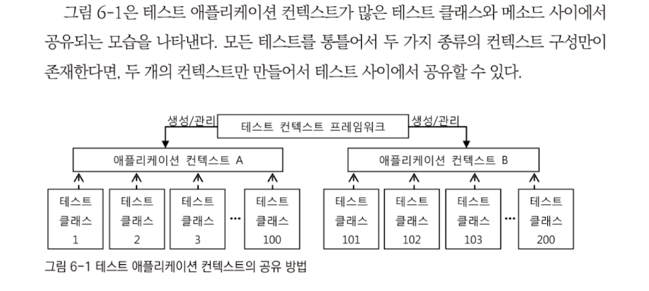

# 5장 AOP와 LTW

## 5.1 애스펙트 AOP

### 5.1.1 프록시 기반 AOP

- AOP는 모듈화된 부가기능과 적용대상의 조합을 통해 여러 오브젝트에 산재해서 나타나는 공통적인 기능을 손쉽게 개발하고 관리할 수 있는 기술

#### AOP 인터페이스 구현과 <bean> 등록을 이용하는 방법

- 가장 기초적인 프록시 AOP 개발 방법은 AOP의 구성요소를 모두 클래스로 개발하고 빈드로 적용하는 방법
- 어떻게 동작하고 적용되는지 이해하기에 가장 쉬움

1. 어드바이스, 포인트컷 개발
2. 빈으로 등록
3. 조합으로 어드바이저 구성
4. 빈으로 등록
5. 준비된 어드바이저를 프록시로 만들어 빈에게 적용해주는 자동 프록시 생성기 빈 등록

#### AOP 인터페이스 구현과 aop 네임스페이스의 태그를 이용하는 방법

#### 임의의 자바 클래스와 aop 네임스페이스의 태그를 이용하는 방법

#### @AspectJ 애노테이션을 이용한 애스팩트 개발 방법

- @AspectJ는 AspectJ AOP 프레임워크에서 정의된 애노테이션을 이용해 애스팩트를 만들 수 있게 해줌
- 하지만 AspectJ를 사용하는 것은 아님
- @AspectJ는 @Transactional과 마찬가지로 AOP의 구성요소를 애노테이션을 이용해 정의할 수 있게 해줌

#### 자동 프록시 생성기와 프록시 빈

- 스프링 AOP를 사용하면 어떤 방식을 적용하든 프록시 방식의 AOP임
  - 데코레이터 패턴에서 나옴
  - JDK 다이내믹 프록시와 DI를 이용
- AOP 적용은 @Autowired의 타입에 의한 의존관계 설정에 문제를 일으키지 X
- AOP 적용은 다른 빈들이 Target 오브젝트에 직접 의존 못함

#### 프록시의 종류

- 스프링에서는 클래스를 직접 참조하면서 가장 의존관계를 맺고 있는 경우에도 프록시를 적용할 수 있음
- 타깃 클래스 자체를 인터페이스처럼 사용
  - final 클래스와 메소드에는 적용이 안됨
  - 타깃 클래스의 생성자가 두 번 호출됨

### 5.1.2 @AspectJ AOP

- Aspect란 객체지향 언어의 클래스와 비슷한 개념
- 그 자체로 애플리케이션의 도메인 로직을 담은 핵심기능은 아니지만, 많은 오브젝트에 걸쳐서 필요한 부가기능을 추상화해놓은 것
- 하나 이상의 포인트컷과 어드바이스로 구성

#### @AspectJ를 이용하기 위한 준비사항

- 어노테이션은 없음

#### @Aspect 클래스와 구성요소

- 자바 클래스에 @Aspect라는 애노테이션을 붙여서 만듬
- 자바 코드로 만든 메타정보로 활용됨

#### 포인트컷 메소드와 애노테이션

- 포인트컷은 @Pointcut 애노테이션과 메소드의 이름, 파라미터로 정의됨
- 구현 코드는 필요없음

#### 어드바이스 메소드와 애노테이션

- 어드바이스도 포인트컷과 마찬가지로 애노테이션과 메소드를 사용함
- 5가지 종류가 존재함
- @Around @Before @AfterReturning @AfterThrowning @After

#### 파라미터 선언과 바인딩

- 포인트컷 표현식의 타입 정보를 파라미터와 연결하는 방법

\

#### @AspectJ를 이용한 AOP의 학습 방법과 적용 전략

## 5.2 AspectJ와 @Configurable

### 5.2.1 AspectJ AOP

패스

### 5.2.2 빈이 아닌 오브젝트에 DI 적용하기

- 스프링이 직접 제공하는 AspectJ AOP 적용 기능이 하나 있음

#### DI 애스팩트

- AspectJ 기술로 만들어진 DependencyInjectionAspect라는 애스펙트를 제공
- @Configurable이 붙은 도메인 오브젝트가 어디서든 생성될 때마다 이 어드바이스가 적용되어 자동 DI 작업이 일어남
- 빈의 초기화 메소드가 정의되어있다면 실행됨

#### @Configurable

- @Configurable을 붙여주기만 하면 자동으로 등록됨
- 자동 와이어링 방식을 지정할 수 있음

#### 로드타임 위버와 자바 에이전트

- DI 애스팩트를 적용하는 부분

1. AspectJ AOP가 동작할 수 있는 환경설정이 필요함
   - 클래스를 로딩하는 시점에 바이트코드 조작이 가능하도록 로드타임위버를 적용해야함
   - 스프링에서는 AspectJ 로드타임 위버 대신 스프링이 직접 제공하는 방식을 사용할 수 있ㄷ음
2. DI 애스펙트 자체를 등록해서 @Configurable 오브젝트에 어드바이스가 적용되게 해야함

## 5.3 로드타임 위버(LTW)

- 활용하는 기능

  - @Configurable 지원
  - 트랜잭션 AOP의 모드를 AspectJ로 설정했을 때 사용
  - JPA에서 필요로 하는 로드타임 위버로 사용되는 것

- 문제점

  - AspectJ와 JPA 로드타임 위버를 모두 적용해야 한다면 문제가 됨

    - 자바에이전트 옵션은 한 번에 하나만 적용 가능하기 때문

    자바 에이전트는 JVM 레벨에 적용됨

    ​	JVM을 통해 로딩되는 모든 클래스를 다 조사하고 클래스 바이트코드 조작 대상으로 삼기 때문에 서버에 적용하기에는 부담임

- 스프링에서 제공하는 로드타임 위버는 모두 해결해줌

## 5.4 스프링 3.1의 AOP와 LTW

### 5.4.1 AOP와 LTW를 위한 애노테이션

#### @EnableAspectJAutoProxy

- @Aspect로 애스펙트를 정의할 수 있게 해주는 @AspectJ AOP 컨테이너 인프라 빈을 등록해줌

#### @EnableLoadTimeWeaving

- 로드타임 위버를 등록하는 애노테이션

## 5.5 정리

- 스프링에서는 프록시 기반의 AOP 기술을 네 가지 접근 방법을 통해 활용할 수 있다. 각 접근 방법의 장단점을 파악하고 자신에게 맞는 방법을 선택할 수 있어야 한다.

- @Aspect는 Aspect] 스타일의 POJO 애스팩트 작성 방법이다. @AspecUJ는 유연하고 강력한 기능을 가진 애스팩트를 손쉽게 만들게 해주지만, 복잡한 Aspect] 문법과 사용 방법을 익혀야 하는 부담이 있다.

- 스프링은 또한 Aspect]를 스프링 애플리케이션 내에서 간접적으로 활용할 수 있는 몇 가지 방법을 제공한다. @Configur able은 스프링 빈이 아닌 오브젝트에 DI를 적용할 수 있게 해준다.

- 스프링은 다양한 서버환경에서 사용 가능한 편리한 로드타임 위버를 제공해준다.

# 6장 테스트 컨텍스트 프레임워크

## 6.1 테스트 컨텍스트 프레임워크

- 스프링은 테스트에 사용되는 애플리케이션 컨텍스트를 생성하고 관리하고 테스트에 적용해주는 기능을 가진 테스트 프레임워크를 제공함
  - 테스트 컨텍스트 프레임워크
  - 스프링의 IoC/DI를 지원하는 애플리케이션 컨텍스트를 테스트에서 효과적으로 사용하게 해줌

### 6.1.1 테스트 프레임워크와 컨텍스트 테스트

- Junit
  - 3과 4로 구분되며 여기선 4로 설명
- TestNG

#### 테스트용 애플리케이션 컨텍스트 캐싱과 설정파일

- JUnit4에서는 특정 클래스를 상속하지 않아도 테스트 코드를 작성할 수 있음
- @Test 애노테이션만 붙여주면 됨
- 모든 테스트는 서로 영향을 주지 않으며 독립적으로 실행됨
- 매번 컨테이너를 새로 만드는건 매우 비효율적임
  - 테스트가 사용하는 컨텍스트를 캐싱해서 여러 테스트에서 하나의 컨텍스트를 공유할 수 잇는 방법을 제공함
  - 동일한 컨텍스트 구성을 가지는 테스트끼리는 같은 컨텍스트를 공유

- 테스트에 테스트 컨텍스트 프레임워크를 적용하려면 테스트 클래스에 두 가지 애노테이션을 부여해줘야 함

1. @Runwith 애노테이션으로 JUnit 테스트를 실행하는 러너를 스프링이 제공하는걸로 변경
2. 컨텍스트의 설정파일을 지정 -  @ContextConfiguration

#### 컨텍스트 설정의 상속과 컨텍스트 로더

- JUnit 4의 장점은 테스트 클래스가 특정 클래스를 상속하도록 강제하지 않는다는 것
- 테스트 클래스를 구성할 때 필요하면 상속구조를 활용할 수도 있음

### 6.1.2 테스트 코드의 테스트 컨텍스트 활용

- '테스트 컨텍스트 프레임워크'의 '컨텍스트'는 애플리케이션 컨텍스트가 아님
- 테스트에서 사용되는 애플리케이션 컨텍스트를 생성하고 관리해주는 오브젝트를 가리킴

#### 테스트 컨텍스트로부터 DI 받기

- 테스트 클래스틑 테스트 컨텍스트로부터 애플리케이션 컨텍스트와 그에 담긴 빈을 제공받아 테스트 코드에서 사용
  - DI 사용
  - @Autowired, @Resource 등을 사용해서 받을 수 잇음\

#### 공유 컨텍스트 사용 시 주의할 점

- 캐싱 기법을 통해 하나의 컨텍스트를 여러 테스트가 공유할 수 잇따는 건 분명 테스트 컨텍스트 프레임워크의 장점임
- 하지만 컨텍스트를 공유하는 테스트 메소드는 컨텍스트가 자신이 독점하는게 아니기 때문에 그 구성이나 내부 정보를 함부로 변경해서는 안됨
  - 어떤 변경도 못 하게 하는게 좋음
  - 이후에 같은 컨텍스트를 사용하는 테스트에 영향을 미칠 수 있기 때문
- 테스트는 그 실행 순서와 환경에 영향을 받지 않아야 하기 때문에
- 어쩔 수 없이 조작해야한다면 @DirtiesContext 애노테이션을 붙여주면 됨
  - 수행되고 나면 현 테스트 컨텍스트를 강제로 제거함

## 6.2 트랜잭션 지원 테스트

### 6.2.1 테스트 컨텍스트 지원 필요성

#### DAO 단독 테스트

- DAO를 개발한 후에 서비스 계층을 거치지 않고 직접 DAO만 테스트해야 할 때
- 스프링의 데이터 액세스 기술로 만든 DAO는 기본적으로 트랜잭션 동기화를 필요로함
- 트랜잭션을 시작해주는 AOP가 있는 서비스 계층을 통해 접근하지 않으면 DAO 실행이 안 됨
- JDBC는 문제가 안되는데 JPA나 하이버네이트 등은 예외가 발생함
- DAO를 직접 손쉽게 테스트할 수 잇는 방법이 필요함

#### 롤백 테스트

- DB가 참여하는 테스트도 계속 초기 테스트 데이터가 유지되도록 만들 방법

- 테스트에서 진행되는 모든 DB작업을 하나의 트랜잭션으로 묶어서 진행하고 테스트를 마칠 때 트랜잭션을 모두 롤백
  - 롤백 테스트
- 초기 테스트는 공통적으로 사용되는 데이터로 구성하고, 테스트 데이터를 등록하거나 수정, 이후에 롤백시켜버림 -> 영향을 미치지 않음

### 6.2.2 트랜잭션 지원 테스트 작성 방법

- 트랜잭션 매니저를 이용할 수 있으면 트랜잭션도 제어할 수 있음

#### @Transactional 테스트

- DB를 이용하는 테스트의 요구조건을 모두 만족
- 하지만 테스트코드가 지저분해짐
- AOP처럼 적용할 수 없음
- 테스트 컨텍스트 프레임워크는 비슷하게 사용할 수 있도록 해줌
- AOP에 의해 동작되는게 아님

#### ORM 롤백 트랜잭션 테스트의 주의사항

- ORM은 기본적으로 모든 작업 결과를 바로 DB에 반영하지 않음
- 꼭 필요한 시점에 반영하게 됨
- 최적화를 위한 트랜잭션 내의 캐싱 기법
- 플러시를 사용하여 적용함
- DAO에 대한 제대로 된 테스트를 하기 위해서는 flush() 메소드를 호출해야함

#### 트랜잭션 지원 테스트에 DBUnit 이용하기

- DB가 사용되는 테스트를 만들 때 유용하게 쓸 수 있는 지원 라이브러리

## 6.3 스프링 3.1의 컨텍스트 테스트 프레임워크

### 6.3.1 자바 코드 설정정보와 프로파일 활용

#### @Configure 클래스 테스트

- @Configuration 클래스도 사용이 가능함

#### @ActiveProile

- 활성 프로파일지정

## 6.4 정리

- 테스트 컨텍스트 프레임워크를 사용하면 컨텍스트 캐싱을 통해 테스트 성능을 향상시킬 수 있다.
- 테스트 컨텍스트 정보는 상속도 가능하다.
- 테스트 오브젝트는 빈은 아니지만 테스트 컨텍스트의 도움으로 애플리케이션 컨텍스트로부터 테스트에 필요한 빈을 주입받을 수 있다. 주요 DI용 애노테이션을 활용할 수 있다.
- DAO를 단독으로 테스트하거나 테스트 작업이 다른 테스트에 영향을 주지 않기 위해서는 롤백 테스트로 만들어야 한다.
- QTransactional은 테스트에서는 롤백 테스트를 만들 때 사용한다.
- ORM에 대한 테스트는 ORM의 캐시가 동작하는 특징을 잘 이해하고 사용해야 한다.
- DBUnit을 트랜잭션 테스트에 활용하면 테스트 데이터를 손쉽게 등록할 수 있다.

# 7장 스프링의 기타 기술과 효과적인 학습 방법