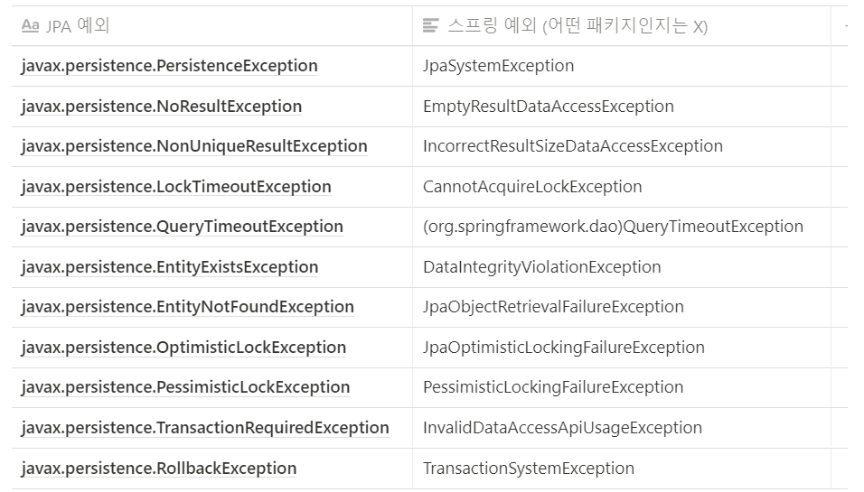

# 2.1 ~ 2.8

## 2.1 공통 개념

### DAO 패턴

데이터 엑세스 계층(DAO)을 분리하는 것

가장 큰 장점은 DAO를 이용하는 서비스 계층의 코드를 기술이나 환경에 종속되지 않는 순수한 POJO로 개발할 수 있다는 것

**예외처리**

데이터 엑세스 중에 발생하는 예외는 대부분 복구할 수 없다. 

따라서 DAO 밖으로 던져질 때는 런타임 예외로 전환되어야 한다.

서비스 계층 코드는 DAO가 던지는 대부분의 예외를 직접 다뤄야 할 이유가 없지만, 때로는 중복키 예외나 낙관적인 락킹처럼 DAO가 던지는 예외가 유의미하게 다뤄지는 경우가 있다.

특정 기술이나 DB의 종류에 따라 던져지는 예외의 종류가 달라질 수 있다는 점이 있는데, **스프링**은 이를 해결할 수 있도록 **데이터 예외 추상화 및 스프링의 데이터 예외로 변환해주는 기능을 제공**해준다.

### 템플릿과 API

스프링은 템플릿/콜백 패턴을 이용하여 데이터 엑세스 기술을 위한 템플릿을 제공한다.

또한, 템플릿 대신 데이터 엑세스 기술의 API를 그대로 사용하게 해주기도 한다.

### DataSource

애플리케이션 서버와 DB 사이의 실제 커넥션을 매번 새롭게 만드는 것은 비효율적이고 성능을 떨어뜨린다. 그래서 정해진 개수만큼의 DB 커넥션을 풀(pool)에 준비해두고, 요청할 때마다 꺼내서 할당하고 반납하는 풀링 기법을 이용한다.

- SimpleDriverDataSource

스프링이 제공하는 가장 단순한 DataSource 구현 클래스.

따로 풀을 관리하지 않으므로, 실전에서는 사용하면 안됨

- SingleConnectionDataSource

하나의 물리적인 DB 커넥션만 만들어두고 게속 사용하는 DataSource.

순차적으로 진행되는 통합 테스트에서는 사용 가능하지만, 동시에 두 개 이상의 스레드가 동작하는 경우에는 위험하다. 이것도 실전에서는 사용하면 안됨

- 아파치 Commons DBCP

가장 유명한 오픈소스 DB 커넥션 풀 라이브러리

- 상용 DB 커넥션 풀

일부 상용 DB는 자체적으로 커넥션 풀 라이브러리를 제공해줌.

- JDNI/WAS DB 풀

자바 서버가 자체적으로 제공하는 DB 풀 서비스

JDNI를 통해 DataSource에 접근해야 함

## 2.2 JDBC

스프링 JDBC ≠ JDBC 

### JDBC

JDBC는 자바의 데이터 액세스 기술의 근본이 되는 로우레벨의 API다.

엔티티 클래스와 애노테이션을 이용하는 최신 ORM 기술도 내부적으로는 DB와의 연동을 위해 JDBC를 이용한다.

하지만 JDBC API를 이용한 개발 방식의 한계는 다음과 같다.

- 간단한 SQL 하나를 실행하는 데도 매우 번잡한 코드가 필요하다.
- DB에 따라 일관성 없는 정보를 가진 채로 던져지는 체크 예외를 처리해야 한다.
- SQL은 코드 내에서 직접 문자로 제공해야 한다.
- 자칫 커넥션과 같은 공유 리소스를 제대로 릴리스해주지 않으면 심각한 버그를 초래할 수 있다.

**스프링 JDBC**는 위와 같은 JDBC 개발의 장점과 단순성을 그대로 유지하면서도 기존 JDBC API 사용 방법의 단점을 템플릿/콜백 패턴을 이용해 극복할 수 있게 해주며, 가장 간결한 형태의 API 사용법을 제공한다. 또한, 기존 JDBC API에서는 지원되지 않는 편리한 기능을 제공해주기도 한다.

### 스프링의 JDBC 접근 방법

- SimpleJdbcTemplate

방대한 템플릿 메소드와 내장된 콜백을 제공하며, JDBC의 모든 기능을 최대한 활용할 수 있는 유연성을 갖는다.

- SimpleJdbcInsert, SimpleJdbcCall

DB가 제공해주는 메타정보를 활용해서 최소한의 코드만으로 단순한 JDBC 코드를 작성하게 해준다.

**현재는 @Deprecated 된 기술로, JdbcTemplate를 사용하는 것이 좋음**

### 스프링 JDBC가 해주는 작업

- Connection 열기/닫기
- Statement 준비/닫기
- Statement 실행
- ResultSet 루프 (루프를 돌면서 각각의 로우를 처리 및 오브젝트에 어떤 형태로 담을지)
- 예외처리와 반환 (체크예외를 런타임 예외로 전환 및 에러 코드를 참고하여 변환해줌)
- 트랜잭션 처리

스프링 JDBC가 이런 대부분의 작업을 해주기 때문에 개발자는 데이터 엑세스 로직마다 달라지는 부분만 정의해주면 된다.

또한, DB 커넥션을 가져올 DataSource를 정의해주면 된다.

```java
public class MemeberDao {
	SimpleJdbcTemplate simpleJdbcTemplate;

	@Autowired
	public void setDataSource(DataSource dataSource) {
		this.simpleJdbcTemplate = new SimpleJdbcTemplate(dataSource);
	}
}
```

(스프링 JDBC 메소드 사용 예시는 생략하겠다.)

## 2.4 JPA

**JPA(Java Persistent API)**

JavaEE와 JavaSE를 위한 영속성 관리와 ORM을 위한 표준 기술이다.

> ORM이란 오브젝트와 RDB 사이에 존재하는 개념과 접근 방법, 성격의 차이 때문에 요구되는 불편한 작업을 제거해줘서 자바 개발자가 오브젝트를 가지고 정보를 다루면 ORM 프레임워크가 이를 RDB에 적절한 형태로 변환해주거나 그 반대로 RDB에 저장되어 있는 정보를 자바 오브젝트가 다루기 쉬운 형태로 변환해주는 기술
> 

### EntityManagerFactory

- JPA 퍼시스턴스 컨텍스트에 접근하고 엔티티 인스턴스를 관리하려면 JPA의 핵심 인터페이스인 EntiyManager를 구현한 오브젝트가 필요하다.
- 컨테이너가 관리하는 (JavaEE 환경과 서버가 필요한) EntityManager와 애플리케이션이 관리하는 (JavaEE와 JavaSE에서 모두 사용 가능한) EntityManager가 있다.

EntityManager를 이용하기 위해서는 반드시 EntityManagerFactory를 빈으로 등록해야 한다.

**JPA는** 단순한 자바 코드로 만들어진 엔티티 **클래스의 바이트코드를 직접 조작**해서 확장된 기능을 추가하는 방식을 이용한다. (지연로딩, 변경감지, 최적화와 그룹 페칭 등)

클래스의 바이트 코드를 조작하는 방법은 두가지가 있다.

1. 바이트코드를 빌드 중에 변경하는 것
2. 런타임 시에 클래스 바이트코드를 메모리에 로딩하면서 다이내믹하게 바이트코드를 변경해서 기능을 추가하는 방법
    
    → 런타임 시에 클래스를 로딩하면서 기능을 추가하는 것을 **로드타임 위빙**이라 하고, 이런 기능을 가진 클래스를 **로드타임 위버**라고 한다.
    

> 대부분의 JPA 구현 제품은 자바 에이전트를 이용해 로드타임 위버를 적용할 수 있는데, 이 방법은 엔티티뿐만 아니라 로딩되는 모든 클래스를 일일이 다 확인하므로 서버의 성능에 영향을 줄 수 있다.
> 

그래서 스프링은 자바 에이전트를 대신할 수 있는 적용 방법을 제공한다. (5장에서 다룸)

### 트랜잭션 매니저

컨테이너가 관리하는 EntityManager 방식에서는 트랜잭션 매니저가 반드시 필요하다. (다만, JDBC는 트랜잭션 매니저가 없어도 동작한다.) 

### EntityManager

스프링에서는 템플릿 방식의 JpaTemplate뿐 아니라 JPA API를 직접 사용해서 DAO를 작성할 수 있다.

JPA의 핵심 프로그래밍 인터페이스는 EntityManager다. EntityManager 오브젝트를 가져올 수 있으면 JPA의 모든 기능을 이용할 수 있다.

EntityManager를 사용하는 방법

1. **JpaTemplate**
    
    → 템플릿 방식으로 JPA 코드를 작성할 수 있게 해줌.
    
    → 자주 사용되지는 않음
    
2. **애플리케이션 코드가 관리하는 EntityManager와 @PersistenceUnit**
    
    → EntityManager em = entityManagerFactory.createEntityManager();
    
    → 컨테이너가 관리하지 않으므로 트랜잭션의 begin()과 commit() 등의 처리를 직접 해줘야 한다.
    
    → @Autowired 로 EntityManagerFactory를 DI 받은 후 사용
    
    → 또는 @PersistenceUnit으로 주입 받을 수 있음 (스프링에 의존적이지 않다는  장점)
    
    → 하지만 이 방법 또한 자주 사용되지는 않음
    
3. **컨테이너가 관리하는 EntityManager와 @PersistenceContext**
    
    → 가장 대표적인 방법 (@PersistenceContext로 주입받을 수 있음)
    
    → EntityManager는 트랜잭션마다 하나씩만 만들어지고 그 범위 안에서 존재하다가 제거된다.
    
4. **@PersistenceContext와 확장된 퍼시스턴스 콘텍스트**
    
    → @PersistenceContext(type=PersistenceContextType.EXTENDED)
    
    → 트랜잭션 스코프 대신 확장된 스코프를 가지며, 상태유지 세션빈에 바인딩 된다.
    
    → 상태를 가지기 때문에 싱글톤 빈에는 사용할 수 없으며, 상태를 가진 세션빈이나 장기간 지속되는 스코프빈에만 사용될 수 있다.
    

### JPA 예외 변환 AOP

서비스 계층에서 JPA 예외를 직접 사용하면 JPA에 비즈니스 코드가 의존하게 되므로 좋지 않다.

→ 스프링은 JPA 예외를 스프링의 예외로 전환해줄 수 있다.

하지만, JPA에서 발생하는 예외를 JDBC를 사용했을 때처럼 보다 상세한 예외로 치환해주지는 않는다.



출처) 자바 ORM 표준 JPA 프로그래밍, [자바 ORM 표준 JPA 프로그래밍 - JPA의 예외 처리](https://way-be-developer.tistory.com/249)

그렇다면 JPA 예외 변환 기능을 사용하는 방법은 무엇일까?

1. @Repository 애노테이션 사용
2. PersistenceExceptionTranslationPostProcessor를 @Bean으로 등록

## 트랜잭션

우리는 일반적으로 선언적 트랜잭션을 통해 트랜잭션 스크립트 방식의 코드를 탈피할 수 있었다.

> 트랜잭션 스크립트란?
하나의 트랜잭션 안에서 동작해야 하는 코드를 한 군데 모아서 만드는 방식
> 

또한, 의미 있는 작은 단위로 만들어진 메소드를 적절한 순서대로 조합해서 트랜잭션의 동작 방식도 제어할 수 있었다.

스프링은 이러한 선언적 트랜잭션 기능을 복잡한 환경이나 구현조건 없이도 평범한 POJO로 만든 코드에 적용할 수 있게 해준다.

### 트랜잭션 추상화와 동기화

트랜잭션 서비스의 종류는 데이터 액세스 기술보다 더 다양하다.

트랜잭션 서비스는 데이터 액세스 기술은 변하지 않더라도 환경이 어떤지에 따라 바뀔 수 있기 때문이다.

스프링은 트랜잭션 추상 계층을 이용하여 트랜잭션 기능을 활용할 수 있도록 해주고, 데이터 액세스 기술과 트랜잭션 서비스 사이의 종속성을 제거해준다.

### 트랜잭션 매니저의 종류

- DataSourceTransactonManager
- JpaTransactionManager
- HibernateTransactionManager
- JmsTransactionManager, CciTransactionManager
- JtaTransactionManager

### 트랜잭션 경계설정 전략

트랜잭션의 시작과 종료가 되는 경계는 보통 서비스 계층 오브젝트의 메소드이다.

트랜잭션 경계를 설정하는 방법은 코드에 의한 프로그램적인 방법과 AOP를 이용한 선언적인 방법이 있다.

- **코드에 의한 트랜잭션 경계 설정**
    
    TransactionTemplate를 만들어서 속성을 변경할 수 있지만 실제로는 이 방법 자체가 많이 쓰이지 않는다.
    
    테스트 코드에서 의도적으로 트랜잭션을 만들고 종료시키거나 여러 번 트랜잭션을 거치는 상황을 만들어야 하는 경우에는 유용할 수 있다.
    
- **선언적 트랜잭션 경계 설정**
    
    코드에는 전혀 영향을 주지 않으면서 특정 메소드 실행 전후에 트랜잭션이 시작되고 종료되거나 기존 트랜잭션에 참여하도록 만들 수 있다.
    
    → 이를 위해서는 데코레이터 패턴을 적용한 트랜잭션 프록시 빈을 사용해야한다.
    

AOP를 이용해 트랜잭션 기능을 부여하는 방법은 다음과 같다.

- **aop와 tx 네임스페이스**
    
    ```java
    <tx:advice id=”txAdvice” transaction-manager=”transactionManager”>
    	<tx:attributes>
    		<tx:method name="*" />
    	</tx:attributes>
    </tx:advice>
    ```
    
    선언이 조금 복잡해 보이지만 코드에는 전혀 영향을 주지 않고 일괄적으로 적용할 수 있다는 장점이 있다.
    
- **@Transactional**
    
    우리가 사용하는 가장 일반적인 방법이다.
    
    인터페이스 < 클래스 < 메소드 순으로 적용 우선순위가 크다.
    
    일일이 인터페이스나 클래스, 메소드에 적용해야 한다는 단점이 있지만 위 방법보다 훨씬 세밀한 설정이 가능하다.
    

### 프록시 모드: 인터페이스와 클래스

스프링의 AOP는 기본적으로 **다이내믹 프록시 기법**을 이용해 동작한다. 다이내믹 프록시를 적용하려면 인터페이스가 있어야 한다.

만약, 인터페이스가 없는 레거시 클래스 코드에 그대로 사용하고 싶다면, CGLib 라이브러리가 제공해주는 클래스 레벨의 프록시도 사용할 수 있다.

→ 다만 이 경우에는 인터페이스가 있는 클래스에도 클래스 레벨의 프록시를 사용하려면 별도의 설정이 필요하고, 클래스 프록시의 제약사항 등을 파악해야 하기 때문에 완벽한 이해를 전제로 사용하는 것이 바람직하다.

### AspectJ의 AOP 방식

스프링의 프록시 AOP 방식 대신에 AspectJ의 AOP를 사용할 수 있는데, 이는 스프링과 달리 타깃 오브젝트 자체를 조작해서 부가기능을 직접 넣는 방식이다.

그렇기 때문에 스프링 AOP에서는 불가능한 다양한 조인 포인트와 고급 기능을 이용할 수 있다.
(자기 자신 클래스의 메소드를 호출하더라도 AOP가 적용되는 점 등)

### 트랜잭션 속성

**트랜잭션 전파: propagation**

- REQUIRED : 디폴트 속성이며, 미리 시작된 트랜잭션에 참여하고 없으면 새로 시작함
- SUPPORTS : 미리 시작된 트랜잭션에 참여하고 없으면 트랜잭션을 실행하지 않음
- MANDATORY : 미리 시작된 트랜잭션에 참여하고 없으면 예외를 발생시킴
- REQUIRES_NEW : 항상 새로운 트랜잭션을 시작
- NOT_SUPPORTED : 트랜잭션을 사용하지 않게 함. 이미 진행중인 트랜잭션이 있으면 보류
- NEVER : 트랜잭션을 사용하지 않도록 강제함. 이미 진행 중인 트랜잭션이 있으면 예외 발생
- NESTED : 중첩 트랜잭션을 생성 ( 부모 실패 → 자식 실패, 자식 실패 → 부모는 영향 없음)

**트랜잭션 격리수준: isolation**

- DEFAULT 일반적으로 READ_COMMITTED임. 일부 DB는 다를 수 있으므로 찾아봐야 함.
- READ_UNCOMMITTED : 가장 낮은 격리 수준. 하나의 트랜잭션이 커밋되기 전에 그 변화가 다른 트랜잭션에 그대로 노출됨. 가장 빠르지만 데이터의 일관성이 조금 떨어짐.
- READ_COMMITTED : 가장 많이 사용되는 격리 수준. 하나의 트랜잭션이 읽은 로우를 다른 트랜잭션이 수정할 수 있음. 처음 트랜잭션이 같은 로우를 다시 읽을 경우 다른 내용이 발견될 수 있음.
- REPEATABLE_READ : 하나의 트랜잭션이 읽은 로우를 다른 트랜잭션이 수정하는 것을 막아줌. 수정만 막아줄 뿐 로우가 추가되는 것은 제한하지 않음.
- SERIALIZABLE : 가장 강력한 트랜잭션 격리 수준. 극단적으로 안전한 작업이 필요한 경우가 아니라면 성능을 고려하여 사용하지 않음.

**트랜잭션 제한시간: timeout**

**읽기전용 트랜잭션: read-only, readOnly**

**트랜잭션 롤백 예외: rollback-for, rollbackFor, rollbackForClassName**

**트랜잭션 커밋 예외: no-rollback-for, norRollbackFor, noRollbackForClassName**

### 데이터 액세스 기술 트랜잭션의 통합

DB는 하나이지만 두 가지 이상의 데이터 액세스 기술(ex, JDBC, iBatis, JPA, Hibernate 등)을 사용할 경우에도 하나의 트랜잭션 안에서 사용할 수 있다.

다만, 각 경우에 필요한 트랜잭션 매니저별 조합 가능 기술을 살펴봐야 한다.

- DataSourceTransactionManager
    
    → JDBC와 iBatis를 함께 사용할 수 있음 (단, 동일한 DataSource를 사용해야함)
    
- JpaTransactionManager
    
    → JPA + JDBC 또는 JPA + iBatis (단, 동일한 DataSource를 사용해야함)
    
- HibernateTransactionManager
    
    → 하이버네이트 + JPA/JDBC/iBatis (단, 동일한 DataSource를 사용해야함)
    
- JtaTransactionManager
    
    → 서버가 제공하는 트랜잭션 서비스를 모든 정류의 데이터 엑세스 기술의 DAO가 한 트랜잭션 안에서 동작할 수 있게 해줌
    

### ORM과 비 ORM DAO를 함께 사용할 때의 주의사항

JPA나 하이버네이트와 같은 ORM DAO는 영속성컨텍스트와 1차캐시를 사용하기 때문에, 이를 통한 변경이 DB에 선반영되지 않을 경우, JDBC나 iBatis 같은 비 ORM DAO가 쿼리를 실행할 때 누락될 수 있음에 유의해야함