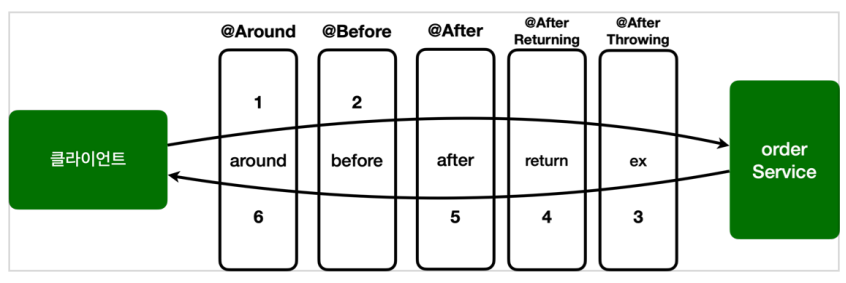

# 5장

## 애스펙트 AOP

**AOP**는 모듈화된 부가기능과 적용 대상의 조합을 통해 여러 오브젝트에 산재해서 나타나는 공통적인 기능을 손쉽게 개발하고 관리할 수 있는 기술이다.

**프록시 방식의 AOP**는 객체지향 디자인 패턴의 데코레이터 패턴 또는 프록시 패턴을 응용해서, 기존 코드에 영향을 주지 않은 채로 부가기능을 타깃 오브젝트에 제공할 수 있는 객체지향 프로그래밍 모델로부터 출발한다.

**스프링에서의 AOP 개발 방법의 종류**

- AOP 인터페이스 구현과 <bean> 등록을 이용하는 방법
    
    → 가장 기초적인 방법
    
    → 어드바이스와 포인트컷을 개발하고 빈으로 등록
    
    → 어드바이스와 포인트컷을 조합한 어드바이저를 빈으로 등록
    
- AOP 인터페이스 구현과 aop 네임스페이스 <aop:advisor> 태그를 이용하는 방법
- 임의의 자바 클래스와 aop 네임스페이스 <aop:aspect>를 이용하는 방법
- @AspectJ 애노테이션을 이용한 애스펙트 개발 방법
    
    → 우리에게 가장 친숙한 방법 (이후에 소개) (실무에서도 거의 이 방식을 사용한다고 함)
    

### 자통 프록시 생성기와 프록시 빈

스프링 AOP를 사용한다면 위에서 어떤 방식을 적용하든 모두 프록시 방식의 AOP이다.

스프링은 **자동 프록시 생성기**를 이용해서 컨테이너 초기화 중에 만들어진 빈을 바꿔치기해 프록시 빈을 자동으로 등록시켜준다. (XML이나 애노테이션을 통해 이미 정의된 빈의 의존관계를 바꿔치기하는 것은 빈 후처리기를 사용한다.)

스프링의 자동 프록시 생성기에 의해서 만들어지는 프록시는 수동으로 등록한 프록시와 다른점이 있다.

→ 프록시 빈을 별도로 추가하고 DI 설정만 바꿔주는 것이 아니라, 프록시를 적용할 대상 자체를 아예 자신이 포장해서 마치 그 빈처럼 동작한다.

**수동 프록시 빈 방식 : Clinet → Proxy → Target**

**자동 프록시 생성 방식 : Client → Proxy{ Target }**

단, 자동 프록시 생성 방식을 사용한다면 다음 두 가지를 기억해야 한다.

1. AOP 적용은 @Autowired의 타입에 의한 의존관계 설정에 문제를 일으키지 않는다.
2. AOP 적용은 다른 빈들이 Target 오브젝트에 직접 의존하지 못하게 한다.
    
    → Proxy가 Target에 대한 의존관계를 갖는 것이 아닌, Proxy가 Target 빈을 감춰버리기 때문에, 기존에 Target을 직접 의존하던 클래스가 있다면 DI 오류를 발생시킨다.
    

### 프록시의 종류

프록시의 종류는 **인터페이스 프록시**, **클래스 프록시**가 존재한다.

지금까지 나온 AOP의 프록시는 인터페이스를 구현한 프록시였다. 따라서 Target이 되는 클래스는 반드시 인터페이스의 구현체여야 한다.

**그렇다면, 클래스 프록시는 어떻게 쓰는가?**

→ CGLib라는 바이트코드 생성 라이브러리를 통해 사용할 수 있다.

→ 하지만 이는 복잡하며, 또한 객체지향적인 설계에서 벗어나므로 **사용을 지양하는 것이 좋다.**

→ 그럼에도 불구하고 나온 이유는, 레거시 코드나 외부 라이브러리의 클래스를 사용하는 경우를 위한 것

### @AspectJ AOP

- 스프링에서 제공하는 @AspectJ 를 통한 AOP 개발 방식이다.
    
    **(타깃 클래스 자체를 바꿔버리는 AspectJ AOP와는 엄연히 다름)**
    
- 실무에서도 거의 이 방식을 사용한다고 한다.

포인트컷: @Pointcut

- 리턴 타입, 접근제한자, 메소드명, 파라미터 타입, 예외 타입, 빈 이름 등 여러 조건 존재

어드바이스: @Before, @AfterReturning, @AfterThrowing, @After, @Around

- 이중에서 Around가 가장 강력함

@AspectJ 는 AspectJ AOP의 일부 용어와 개념을 차용한 수준이라 AspectJ AOP보다는 단순하지만, 그렇다고 불필요하게 모든 메소드 호출을 로그에 남긴다거나, 무분별한 AOP 적용은 지양해야 한다.

### AspectJ AOP

AspectJ는 가장 강력한 AOP 프레임워크다.

자바 클래스의 바이트코드 조작과 재컴파일을 통해 AOP를 적용한다.

조인 포인트는 메소드 실행 지점 외에도 필드 일기와 쓰기, 스태틱 초기화, 인스턴스 생성 및 초기화 등에도 지원한다.

스프링의 AOP에서 지원하는 AspectJ AOP 기능이 있는데, **‘빈 등록이 되지 않은 오브젝트에 DI 적용하기’를 할 경우**이다.