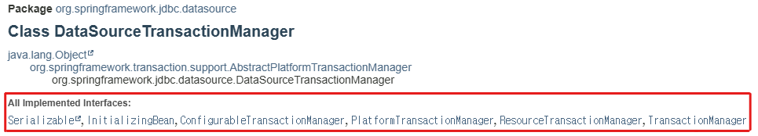
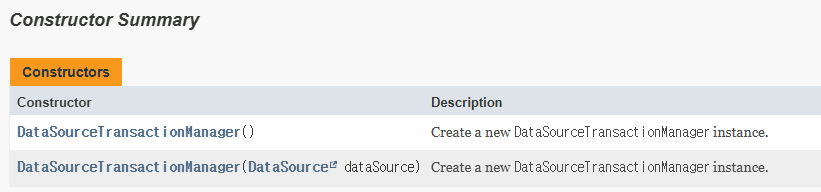

# 7장

## 스프링 기술과 API를 효과적으로 학습하는 방법

어떤 오브젝트가 빈으로 사용된다는 데는 두 가지 의미가 있다.

1. 다른 빈에 의해 DI 돼서 사용되는 서비스라는 의미
2. 다른 빈이나 정보에 의존하고 있다는 의미 (다른 빈을 DI받아 사용한다는 의미)

대부분의 스프링 기능은 빈으로 등록하는 방식을 통해 이용할 수 있다.

그리고 빈의 이 두가지 특징을 알고 싶다면 빈으로 등록된 클래스의 **구현 인터페이스**와 **프로퍼티 목록**을 살펴보면 된다.

### 구현 인터페이스 분석

스프링뿐만 아니라, 어떤 클래스의 기능에 무엇이 있는지 알기 위해서는 인터페이스 목록을 확인하면 좋다.



위 사진을 예로 들면, 이 인터페이스는 PlatformTransactionManager와 ResourceTranscationManager, TransactionManager 인터페이스를 implementation 하고 있다.

이 중에 PlatformTransactionManager 인터페이스의 API 문서를 읽어보면, DataSourceTransactionManager가 무엇을 하는지, 그리고 이를 필요로 하는 기능은 어떤 것인지 파악할 수 있다.

### 프로퍼티 분석

또한, 빈 클래스의 프로퍼티 중에서 인터페이스 타입의 프로퍼티를 볼 수도 있다.



예를들어, DataSourceTransactionManager는 DataSource 인터페이스를 주입받는다.

우리가 아는 인터페이스의 장점은 자유로운 변경과 확장이다.

즉 DataSource 라는 인터페이스를 통해 다른 빈을 참조한다는 건, 이 인터페이스를 통해 기능을 확장할 수 있다는 뜻이며, DI에 따라 우리가 필요로하는 부가기능을 제공받을 수 있다는 것을 의미한다.

## IOC 컨테이너 DI

스프링에서 가장 많이 사용되는 IoC 컨테이너의 확장 포인트는 바로 빈 후처리기와 빈 팩토리 후처리기 두 가지이다.

빈 후처리기는 BeanPostProcessor 인터페이스로 정의되어 있고, 빈 팩토리 후처리기는 BeanFactoryPostProcessor 인터페이스로 정의되어 있다.

### BeanPostProcessor

postProcessBeforeInitialization() 메소드는 빈 오브젝트가 처음 만들어지고, 아직 초기화 메소드가 호출되기 이전에 실행된다.

postProcessAfterInitialization() 메소드는 반대로 초기화 메소드가 호출된 이후에 실행된다.

AOP의 동작원리인 자동 프록시 생성기도 역시 BeanPostProcessor를 구현한 빈이다.

### BeanFactoryPostProcessor

컨테이너는 빈 팩토리 후처리기가 있으면 빈의 메타정보 자체를 조작할 수 있다. (프로퍼티 값을 추가로 설정하는 수준이 아니라, 아예 새로운 빈을 등록할 수도 있다.)

@Configuration 태그가 붙은 클래스로 빈을 등록할 수 있는 것도 BeanFactoryPostProcessor가 있기 때문이다.

## OXM

XML과 자바 오브젝트를 매핑해서 상호 변환해주는 기술을 뜻한다.

## 리모팅과 웹 서비스

리모팅은 원격 시스템과 스프링 애플리케이션이 연동해서 동작하게 해주는 기술이다.

원격 서비스를 제공하는 것, 제공받아 이용하는 것 모두 리모팅이다.

스프링은 Exporter 빈이나 프로깃 빈을 통해 원격 서비스를 제공하거나 호출한다.

## 태스크 실행과 스케줄링

### TaskExecutor 서비스 추상화

독립적인 스레드 안에서 동작하도록 만들어진 오브젝트를 태스크(task)라고 부른다.

스프링은 이런 태스크를 다양한 방법으로 실행하도록 만들어진 오브젝트 특징을 추상화한 TaskExecutor라는 인터페이스를 제공한다. (서비스 추상화)

스프링이 구현한 몇 가지 TaskExecutor에는 동기화 실행 방식도 있고, 스레드풀을 사용하지 않고 계속 새로운 스레드를 만드는 방식도 있지만, 비동기 방식으로 스레드 풀을 이용해 실행되는 것이 유용하게 쓰인다.

### TaskScheduler

TaskScheduler 인터페이스는 주어진 태스크를 조건에 따라 실행하거나 반복하는 작업을 수행한다.

### 애노테이션을 이용한 스케줄링과 비동기 태스크 실행

우리는 애노테이션을 이용해 스케줄링을 구현한 경험이 있을 것이다.

@Scheduled 애노테이션을 통해 메소드에 스케줄링을 간단하게 적용할 수 있다.

@Async 애노테이션을 통해 메소드에 비동기 방식을 간단하게 적용할 수 있다.

물론 위 애노테이션을 같이 사용할 수도 있다.

## 캐시 추상화

스프링은 트랜잭션과 마찬가지로 AOP를 이용해 메소드 실행 과정에 쉽게 캐시 기능을 부여할 수 있도록 해준다.

또한, 캐시 서비스 구현 기술에 종속되지 않도록 추상화 서비스를 제공해준다.

(JPA나 하이버네이트 같은 ORM과 DB 또한 내부적으로 제공하는 캐시 기능이 있다.)

**캐시**는 기본적으로 성능의 향상을 위해 사용된다. **동일하고 반복적인 요청에 대해서 결과를 만드는 대신에 보관해뒀던 기존 결과를 돌려주는 방식**이다.

캐싱을 적용하면 DB와 애플리케이션 서버의 부하가 그만큼 줄기 때문에 처리 속도도 빨라지고 더 많은 사용자 요청을 처리할 수 있다.

**다만, 캐시는 동일한 결과가 반복적으로 필요한 작업에만 이용하고, 매번 다른 결과를 돌려줘야하는 작업에는 오히려 성능이 떨어진다.**

또 한가지 유의할 점은, 캐시에 저장해둔 내용이 바뀌는 상황을 잘 파악하여 적용하는 것이다.

### 애노테이션을 이용한 캐시 속성 부여

**@Cacheable**

클래스나 인터페이스 레벨에 캐시를 지정할 수도 있지만, 여러 메소드에 일괄적인 설정을 하는 경우는 드물다. 따라서 캐시를 적용할 메소드에 @Cacheable 애노테이션을 붙이자.

```java
@Cacheable("product")
public Product bestProduct(String productNo) {
	...
}

// 사용 예시
{
	bestProduct("A-001")
}
```

“product”라는 캐시로부터 “A-001”이라는 키 값으로 저장된 오브젝트가 있다면 메소드를 실행하지 않고, 없다면 메소드를 실행한다.

### 캐시 제거

캐시는 적절한 시점에 제거돼야 한다. (캐시 값과 메소드 실행 결과가 불일치하지 않도록)

**캐시를 제거하는 방법은 두 가지가 있다.**

하나는 일정한 주기로 캐시를 제거하는 것, 다른 하나는 캐시에 저장한 값이 변경되는 상황을 알 수 ****있다면 이를 이용해 캐시를 제거하는 것

**@CacheEvict(value=” “, key=”  “)**

이 애노테이션이 달린 메서드를 실행하면 key값에 해당하는 캐시를 제거한다.

### 캐시 매니저

스프링은 트랜잭션 매니저와 같이, 캐시 또한 API를 이용할 수 있게 하는 서비스 추상화를 제공한다.

트랜잭션 매니저와 마찬가지로, 적용할 캐시 기술을 지원하는 캐시 매니저를 빈으로 등록해줘야 한다.

스프링 3.1에서 제공하는 다섯가지 CacheManager

- ConcurrentMapCacheManager
- SimpleCacheManager
- EhCacheCacheManager
- CompositeCacheManager
- NoOpCacheManager