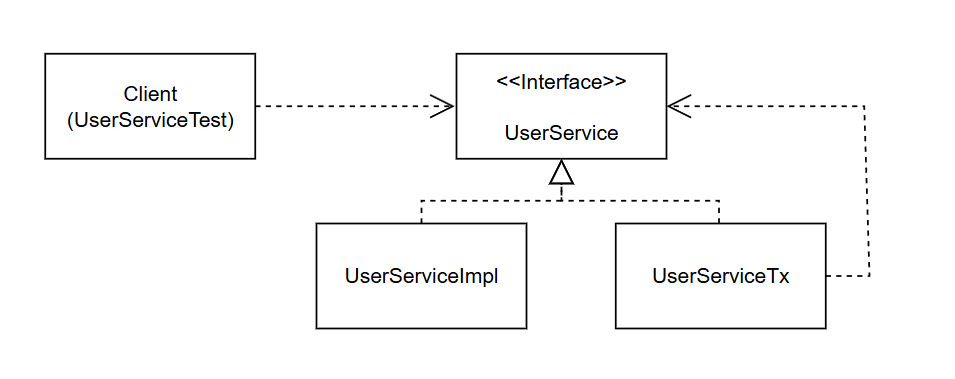
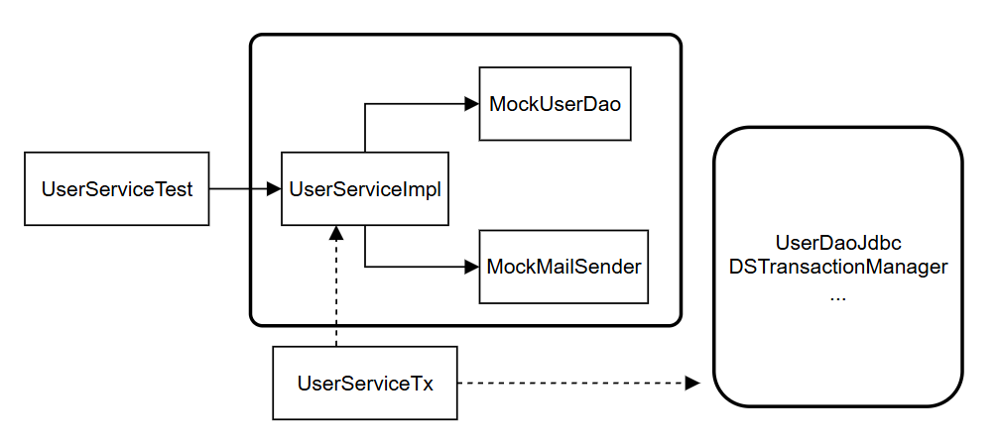

# 1주차

## 6.1

다음과 같이 트랜잭션 기능과 핵심 기능이 있는 코드가 있다면 어떨까?

```java
public class UserService {

	...

	public void upgradeLevels() throws Exception {
		TransactionStatus status = this.transactionManager
			.getTransaction(new DefaultTransactionDefinition());
		try {
			List<User> users = userDao.getAll();
			for (User user : users) {
					if (canUpgradeLevel(user)) {
							upgradeLevel(user);
			}
		}
			
			this.transactionManager.commit(status);			
		} catch (Exception e) {
			this.transactionManager.rollback(status);
			throw e;
		}
	}
}
```

트랜잭션 기능과 핵심 기능은 성격도 다르고, 주고받는 것도 없는 완벽하게 독립된 코드이다.

따라서 우리는 트랜잭션 기능을 담당하는 클래스와 핵심 기능을 담당하는 클래스를 분리하고 싶다면 인터페이스를 통해 분리하며, 기능을 위임하는 식으로 작성하면 된다.



```java
public calss UserServiceImple implements UserService {
	UserDao userDao;
	MailSender mailSender;
	
	public void upgradeLevels() {
		List<User> users = userDao.getAll();
		for (User user : users) {
				if (canUpgradeLevel(user)) {
						upgradeLevel(user);
		}
	}
	
	...

}
```

위와 같이 트랜잭션 코드를 제거하여 분리하고,

```java
public class UserServiceTx implements UserService {
	UserService userService;
	PlatformTransactionManager transactionManager;
	
	public void setUserService(PlatformTransactionManager transactionManager) {
		this.transactionManager = transactionManager;
	}
	
	public void setUserService(UserService userService) {
		this.userService = userService;
	}
	
	
	public void add(User user) {
		userService.add(user);
	}
	
	public void upgradeLevels() {
	
		try {
			userService.upgradeLevels(); // 위임
		
			this.transactionManager.commit(status);			
		} catch (Exception e) {
			this.transactionManager.rollback(status);
			throw e;
		}
	}
}
```

위와 같이 작업을 UserServiceTx 에서 UserService로 위임하게끔 할 수 있다.

위와 같이 핵심기능과 부가기능을 분리함으로써 얻을 수 있는 장점은 다음과 같다.

1. 비즈니스 로직을 담당하고 있는 UserServiceImpl의 코드에는 트랜잭션과 같은 기술적인 내용에는 전혀 신경쓰지 않고 메인 기능을 개발할 수 있다.
2. 비즈니스 로직에 대한 테스트를 손쉽게 만들어 낼 수 있다.

## 6.2 테스트

테스트를 작성하는 가장 좋은 방법은 가능한 한 작은 단위로 쪼개서 테스트하는 것이다.

그 이유는 테스트를 실패했을 때 원인을 찾기 쉬워지기 때문이다. 처음부터 작은 단위의 테스트로 검증하면서 발전시킨다면, 나중에 덩치가 커져도 어렵지 않게 오류를 찾아낼 수 있다.

하지만, 우리가 진행하는 수많은 프로젝트에서는 복잡한 의존관계가 얽혀있다.


예를 들자면 위와 같이 복잡한 의존관계가 있다.

우리가 UserService 만을 테스트하고 싶다고 하지만, 사실 UserService는 UserDaoJdbc, DSTransactionManager, UserDaoJdbc 등 많은 클래스를 의존하고, 각각의 클래스들도 또다른 클래스를 의존하게 되어, 단위 테스트의 의미보다는 통합 테스트와 가까워진다.

우리는 비즈니스로직이 정상적으로 실행되어 일정한 작업을 수행하고 결과가 도출되는지 확인할 수 있어야 하는데, UserService는 DAO를 통해 DB에 데이터를 반영한다. 

앞서 말했듯이, 우리는 테스트를 가능한 한 작은 단위로 쪼개서 테스트하는 것이 좋다.

그렇다면, 우리가 만약 UserService만을 테스트하고 싶다면 어떻게 해야할까?

우리가 테스트하고 싶은 대상인 UserServiceImpl을 고립시키는 것이다.



테스트의 대상이 환경이나 외부 서버, 다른 클래스에 종속되거나 영향을 받지 않도록 고립시킬 수 있다.

테스트 스텁을 적용하거나, 목 오브젝트를 사용하는 방법을 생각해볼 수 있다.

우리는 UserServiceImpl을 고립시켜 검증하고 싶은 것이기 때문에, DB에 결과를 남기지 않는 방법으로 떠올려 보아야 한다.

이럴 땐 테스트 대상인 UserServiceImpl 객체가 UserDao에게 어떤 요청을 했는지를 확인하면 된다.

UserDao 인터페이스를 구현한 MockUserDao 객체에서는 user 리스트를 메모리에서 직접 관리를 하도록 하고, 비즈니스 로직 실행 전 user 리스트와 실행 후 user 리스트를 반환하도록 하여 테스트 결과를 확인할 수 있도록 구현할 수 있다.

```java
public void upgradeLevels() {
	List<User> users = userDao.getAll();
	for (User user: users) {
		if (canUpdgradeLevel(user)) {
			upgradeLevel(user);
		}
	}
}
	
protected void upgradeLevel(User user) {
	user.upgradeLevel();
	**userDao.update(user); // DB에 쿼리를 날리는 부분.
												// Mock 객체에서는 메모리 변수에만 변화를 주도록 작성하면 됨.**
	sendUpgradeEmail(user);
}
```

### 테스트 수행 성능의 향상

DB까지 연동하여 진행하는 테스트와, 목 오브젝트만을 이용하는 테스트의 수행시간 차이는 크다고 한다.

책에서 언급하는 차이에 따르면, 0.001초도 되지 않는 짧은 시간 안에 테스트가 수행되었다고 한다.

만약 프로젝트의 규모가 커지거나, 테스트의 개수가 매우 많아진다면 이 차이는 눈에 띌 정도로 커질 것이다.

**단점이 있다면 고립 테스트를 진행하기 위한 목 오브젝트를 작성해야 하고, 인터페이스의 수가 늘어난다는 점이 있다.**

**다만, 테스트 속도가 유의미하다는 점, 의존관계에서 벗어난 고립된 단위의 테스트를 진행할 수 있다는 점을 생각하면 충분히 고려해볼만 하다.**

이처럼, 목 오브젝트 등의 테스트 대역을 이용해 의존 오브젝트나 외부의 리소스를 사용하지 않도록 고립시켜 테스트하는 것을 **단위 테스트**라고 하고, 의존관계나 외부 오브젝트, 리소스가 참여하는 테스트를 **통합 테스트**라고 부른다.

책에서 단위 테스트와 통합 테스트에 대해 제시한 가이드라인은 다음과 같다.

- 항상 단위 테스트를 먼저 고려한다.
- 단위 테스트는 테스트 작성도 간단하고 실행 속도도 빠르며, 테스트 대상 외의 코드나 환경으로부터 영향을 받지 않기 때문에 가장 빠른 시간에 효과적으로 테스트를 작성하기에 유리하다.
- 외부 리소르르 사용해야만 가능한 테스트는 통합테스트로 만든다.
- DAO는 고립된 단위 테스트로 작성하기가 힘들다. 따라서 DB 연동까지를 고려하여 DB에 데이터가 잘 반영되었는지 확인하는 부가적인 작업이 필요하다.
- DAO를 이용하는 코드는 스텁이나 목 오브젝트로 대체하여 테스트한다면, 이후에 실제 DAO와 연동했을 때에도 바르게 동작하리라고 확신할 수 있을 것이다.
- 여러 개의 단위가 의존관계를 가지고 동작할 때를 위한 통합 테스트는 필요하다.
- 단위 테스트를 만들기가 너무 복잡하다고 판단되는 코드는 처음부터 통합테스트를 고려해본다.
- 스프링 테스트 컨텍스트 프레임워크를 이용하는 테스트는 통합 테스트이다. 스프링의 설정 자체토 테스트 대상이고, 스프링을 이용해 좀 더 추상적인 레벨에서 테스트해야 할 경우에는 스프링 테스트 컨텍스트 프레임워크를 이용해 통합 테스트를 작성한다.
- TDD를 통해 테스트 코드를 먼저 작성한 후에는 가능한 한 구현 코드를 빨리 작성하도록 해야한다. 오랜 시간이 지나면 코드에 대한 이해가 떨어질 수 있기 때문이다.
- 코드를 작성하면서 테스트는 어떻게 만들 수 있을까를 생각해보는 것은 좋은 습관이다.

리팩토링과 유연성을 위해서는 반드시 테스트를 잘 만들기 위해 노력해야 한다는 것을 명심하자.

목 객체를 생성하기 위해 편리한 기능을 제공해주는 **Mockito 프레임워크**가 있으므로, 한번 이용해보는 것이 좋다. 코드를 효율적이면서 직관적으로 작성할 수 있게 해주는 편리한 도구이다. 또한, 어떤 값을 가지고 몇 번 호출 됐는지, 어떤 메서드가 호출됐는지까지도 확인할 수 있다.

## 6.3 다이나믹 프록시와 팩토리 빈

**프록시(Proxy)란?**

Proxy는 ‘대리’, ‘대신’이라는 뜻을 가진다. 즉 어떤 대상을 대신하는 객체를 생성하여 이를 통해 접근할 수 있도록 하는 것을 말한다.

**그렇다면 우리는 프록시 패턴을 이용해서 얻을 수 있는 이점이 무엇일까?**

**1. 실제 메소드가 호출되기 전후에 필요한 기능을 구현 객체의 코드 변경 없이 추가할 수 있다.**

SOLID 원칙중 OCP를 지키면서 기능을 추가할 수 있다. 핵심 기능이 동작하는 구현 객체의 동작 외에 부가적인 기능(접근 권한 검사 등)을 프록시 객체에서 관리하도록 하여 OCP를 지키면서 새로운 기능을 추가할 수 있다.

**2. 클라이언트가 타깃에 접근하는 방법을 제어할 수 있다.**

프록시 서버는 Forward Proxy와 Reverse Proxy로 나눌 수 있다. 프록시 서버에서 캐싱을 이용하여 시스템 성능을 향상시킬 수 있으며, 클라이언트와 서버의 중간에서 통신을 대신하기 때문에 IP 주소를 가린다거나 내부 구조를 가림으로써 보안성을 향상시킬 수 있다.

위 두가지 이점은 엄밀하게 말하면 디자인 패턴에서 두가지 패턴에 의해 구현된다. 바로 프록시 패턴과 데코레이터 패턴이다.

1. 타깃에 부가적인 기능을 런타임 시 다이나믹하게 부여해주기 위해 데코레이터 패턴을 사용한다고 볼 수 있다. 우리가 구현한 핵심 기능 전후에 부가 기능을 추가할 수 있게 하기 위해 단계적으로 위임하는 구조로 만들어 사용한다.
2. 타깃에 접근하는 방법을 제어하기 위해 프록시 패턴을 사용한다고 볼 수 있다. 클라이언트가 타깃 오브젝트의 메서드를 사용하기 전까지는 프록시를 넘겨주다가, 요청이 들어오면 타깃 오브젝트를 생성하고 요청을 위임해주는 방식이다. 또는 특정 클라이언트(레이어)에 대해서는 읽기전용으로 동작하게 해야할 경우 이를 제어하는 역할도 한다. 이렇게 프록시 패턴은 타깃의 기능 자체에는 관여하지 않으면서 접근하는 방법을 제어해주는 프록시를 이용하는 것이다.

### 동적 프록시

내가 사용할 객체 모두 일일이 프록시 클래스를 정의해줘야 한다면, 클래스가 늘어날수록 내가 관리해야하는 프록시 클래스는 더욱 많아질 것이다.

또한, 트랜잭션 기능처럼 부가기능 코드가 중복될 가능성이 많다는 점도 있다. 

이러한 단점을 보완하여, **컴파일 시점이 아닌 런타임 시점에 프록시 클래스를 만들어주는 것이 동적 프록시(Dynamic Proxy)이다.**

JDK Dynamic Proxy라고도 한다.

동적 프록시는 자바의 리플렉션 기능을 이용해서 프록시를 만들어준다.

리플렉션 API를 통해, Method라는 인터페이스를 이용해 메서드 정보를 얻거나 호출할 수 있고, 클래스의 정보를 알아낼 수도 있다. private 하여 접근에 대해 정의된 필드라 할지라도 말이다.

여기서, 프록시는 Method 인터페이스의 invoke() 함수를 통해 구현된다.

동적 프록시를 구현하는 방법은 Java에서 제공해주는 reflection API의 **newProxyInstance()** 를 사용할 수 있다.

```java
@CallerSensitive
public static Object newProxyInstance(ClassLoader loader,
                                      Class<?>[] interfaces,
                                      InvocationHandler h)
```

인자를 살펴보면 다음과 같다.

- ClassLoader : 프록시 클래스를 만들 클래스로더
- Class : 프록시 클래스가 구현할 인터페이스 목록(배열)
- InvocationHandler : 메서드가 호출되었을때 실행될 핸들러

여기에 포함되는 InvocationHandler는 invoke() 함수만 가지고 있는 인터페이스이다.

```java
public interface InvocationHandler {
    public Object invoke(Object proxy, Method method, Object[] args)
        throws Throwable;
}
```

인자를 살펴보면 다음과 같다.

- Object : 프록시 객체
- Method : 호출한 메서드 정보
- Object[] : 메서드에 전달된 파라미터

따라서, 만약 우리가 동적 프록시를 이용하고 싶다면 다음과 같이 구현할 수 있다.

```java
public interface AInterface {
    String call();
}

public class AImpl implements AInterface{

    @Override
    public String call() {
        System.out.println("A 호출");
        return "a";
    }
}

-----------------------------------------------------------------------------------

public class TimeInvocationHandler implements InvocationHandler {
    private final Object target;

    public TimeInvocationHandler(Object target) {
        this.target = target;
    }

    @Override
    public Object invoke(Object proxy, Method method, Object[] args) throws Throwable {
        System.out.println("TimeProxy 실행");
        long startTime = System.currentTimeMillis();

        Object result = method.invoke(target, args); // 실행시킬 핵심 로직

        long endTime = System.currentTimeMillis();
        long resultTime = endTime - startTime;
        System.out.println("TimeProxy 종료 resultTime=" + resultTime);

        return result;
    }
}

-----------------------------------------------------------------------------------

@Test
void test() {
    AInterface target = new AImpl();
    TimeInvocationHandler handler = new TimeInvocationHandler(target);

    AInterface proxy = (AInterface) Proxy.newProxyInstance(AInterface.class.getClassLoader(),
                                                           new Class[]{AInterface.class}, 
                                                           handler);

    proxy.call();
}
```

dynamicA 테스트 코드의 실행 순서는 다음과 같다.

1. 동적 프록시로 만들어진 proxy.call()을 실행한다.
2. invoke() 메서드가 호출되는데, 3번째 인자인 handler의 구현체가 TimeInvocationHandler로 되어있음으로 TimeInvocationHandler의 invoke() 메서드가 실행된다.
3. invoke() 메서드 안에 작성한 공통로직이 실행되고, method.invoke()메서드를 통해 타겟의 실제 객체인 AImpl의 call() 메서드가 실행된다.
4. AImpl의 실행이 종료되고 값이 반환된다.

이렇게, 동적 프록시를 사용하면 프록시 클래스를 일일이 정의하지 않고, 런타임 시점에 프록시를 생성하여 보다 편리하게 관리할 수 있게 된다.

이처럼, 다이나믹 프록시는 런타임에 생성된다. 반면 스프링의 빈은 기본적으로 클래스의 이름과 프로퍼티에 의해 정의된다. 즉 스프링은 지정된 클래스 이름을 가지고 리플렉션을 이용해서 해당 클래스의 오브젝트를 만드는데, 다이나믹 프록시는 사전에 정의된 것이 없으므로 DI를 적용할 수 없는 것이다.

사실 스프링은 클래스 정보를 가지고 빈을 생성하는 것 외에도 다른 여러 가지 방법을 제공한다. 대표적으로 프록시 팩토리 빈 인터페이스를 이용하는 방법이 있다.

다만, 한 번에 여러 개의 클래스에 공통적인 부가기능을 제공하는 일은 이 방식으로는 불가능 하다. 마찬가지로 하나의 타깃에 여러 개의 부가기능을 적용하는 것도 “한번에” 할 수 없다.

xml 설정을 일일이 매번 해줘야 하기 때문이다.

대신 이러한 단점을 보완해주는 스프링 AOP를 사용할 수 있을 것이다.